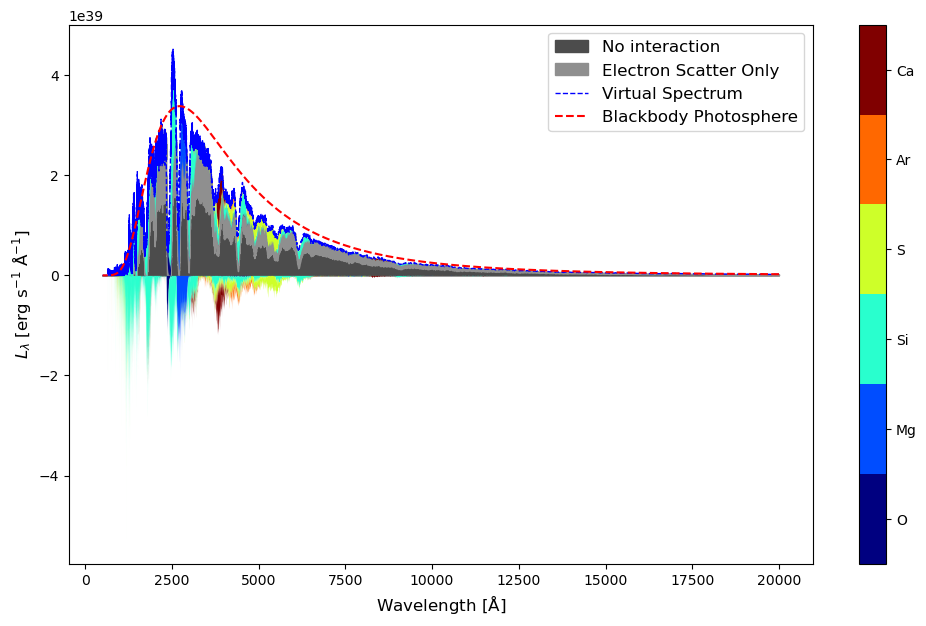
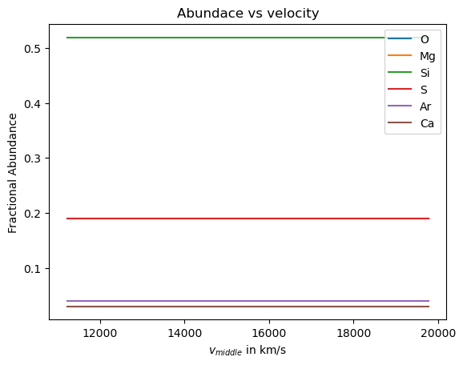
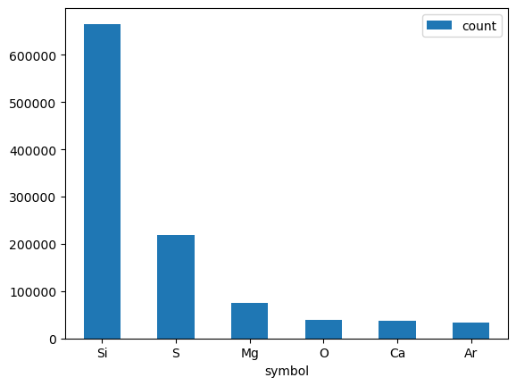

# Velocity Packet Tracker Visulization

## In the below cell, we import necessaries libraries and download the required dataset


```python
from tardis import run_tardis
from tardis.io.atom_data.util import download_atom_data

download_atom_data('kurucz_cd23_chianti_H_He')
```


    Iterations:          0/? [00:00<?, ?it/s]


    Packets:             0/? [00:00<?, ?it/s]


    Atomic Data kurucz_cd23_chianti_H_He already exists in /home/sam/Downloads/tardis-data/kurucz_cd23_chianti_H_He.h5. Will not download - override with force_download=True.


## The configuration file used is:


```python
!cat tardis_example.yml
```

    # Example YAML configuration for TARDIS
    tardis_config_version: v1.0
    
    supernova:
      luminosity_requested: 9.44 log_lsun
      time_explosion: 13 day
    
    atom_data: kurucz_cd23_chianti_H_He.h5
    
    model:
      structure:
        type: specific
        velocity:
          start: 1.1e4 km/s
          stop: 20000 km/s
          num: 20
        density:
          type: branch85_w7
    
      abundances:
        type: uniform
        O: 0.19
        Mg: 0.03
        Si: 0.52
        S: 0.19
        Ar: 0.04
        Ca: 0.03
    
    plasma:
      disable_electron_scattering: no
      ionization: lte
      excitation: lte
      radiative_rates_type: dilute-blackbody
      line_interaction_type: macroatom
    
    montecarlo:
      seed: 23111963
      no_of_packets: 4.0e+4
      iterations: 20
      nthreads: 1
    
      last_no_of_packets: 1.e+5
      no_of_virtual_packets: 10
    
      convergence_strategy:
        type: damped
        damping_constant: 1.0
        threshold: 0.05
        fraction: 0.8
        hold_iterations: 3
        t_inner:
          damping_constant: 0.5
    
    spectrum:
      start: 500 angstrom
      stop: 20000 angstrom
      num: 10000


## We will run the simulation and keep virtual_packet_logging active since we are going to use virtual packets.

The Simulation Object ```sim``` will contain all the information, we will require in the below steps


```python
sim = run_tardis("tardis_example.yml", virtual_packet_logging = True)
```

    [tardis.simulation.base][INFO   ]  
    	
    	Reading Atomic Data from kurucz_cd23_chianti_H_He.h5 (base.py:674)
    [tardis.io.atom_data.util][INFO   ]  
    	
    	Atom Data kurucz_cd23_chianti_H_He.h5 not found in local path.
    	Exists in TARDIS Data repo /home/sam/Downloads/tardis-data/kurucz_cd23_chianti_H_He.h5 (util.py:33)
    [tardis.io.atom_data.base][INFO   ]  
    	Reading Atom Data with: UUID = 6f7b09e887a311e7a06b246e96350010 MD5  = 864f1753714343c41f99cb065710cace  (base.py:258)
    [tardis.io.atom_data.base][INFO   ]  
    	Non provided Atomic Data: synpp_refs, photoionization_data, yg_data, two_photon_data, linelist (base.py:262)
    [tardis.model.parse_input][WARNING]  
    	Number of density points larger than number of shells. Assuming inner point irrelevant (parse_input.py:143)
    [tardis.model.matter.decay][INFO   ]  
    	Decaying abundances for 1123200.0 seconds (decay.py:101)
    [py.warnings         ][WARNING]  
    	/home/sam/tardis/tardis/tardis/plasma/properties/radiative_properties.py:93: RuntimeWarning: invalid value encountered in divide
      (g_lower * n_upper) / (g_upper * n_lower)
     (warnings.py:109)
    [py.warnings         ][WARNING]  
    	/home/sam/tardis/tardis/tardis/plasma/properties/radiative_properties.py:93: RuntimeWarning: invalid value encountered in divide
      (g_lower * n_upper) / (g_upper * n_lower)
     (warnings.py:109)
    [tardis.simulation.base][INFO   ]  
    	
    	Starting iteration 1 of 20 (base.py:391)


    TqdmHBox(children=(HTML(value='Iterations:', layout=Layout(width='6%')), FloatProgress(value=0.0, layout=Layou…


    TqdmHBox(children=(HTML(value='Packets:   ', layout=Layout(width='6%')), FloatProgress(value=0.0, layout=Layou…


    [tardis.simulation.base][INFO   ]  
    	
    	Luminosity emitted   = 7.942e+42 erg / s
    	Luminosity absorbed  = 2.659e+42 erg / s
    	Luminosity requested = 1.059e+43 erg / s
     (base.py:573)
    [tardis.simulation.base][INFO   ]  
    	
    	Plasma stratification: (base.py:541)


<style type="text/css">
</style>
<table id="T_c3213">
  <thead>
    <tr>
      <th class="index_name level0" >Shell No.</th>
      <th id="T_c3213_level0_col0" class="col_heading level0 col0" >t_rad</th>
      <th id="T_c3213_level0_col1" class="col_heading level0 col1" >next_t_rad</th>
      <th id="T_c3213_level0_col2" class="col_heading level0 col2" >w</th>
      <th id="T_c3213_level0_col3" class="col_heading level0 col3" >next_w</th>
    </tr>
  </thead>
  <tbody>
    <tr>
      <th id="T_c3213_level0_row0" class="row_heading level0 row0" >0</th>
      <td id="T_c3213_row0_col0" class="data row0 col0" >9.93e+03 K</td>
      <td id="T_c3213_row0_col1" class="data row0 col1" >1.01e+04 K</td>
      <td id="T_c3213_row0_col2" class="data row0 col2" >0.4</td>
      <td id="T_c3213_row0_col3" class="data row0 col3" >0.507</td>
    </tr>
    <tr>
      <th id="T_c3213_level0_row1" class="row_heading level0 row1" >5</th>
      <td id="T_c3213_row1_col0" class="data row1 col0" >9.85e+03 K</td>
      <td id="T_c3213_row1_col1" class="data row1 col1" >1.02e+04 K</td>
      <td id="T_c3213_row1_col2" class="data row1 col2" >0.211</td>
      <td id="T_c3213_row1_col3" class="data row1 col3" >0.197</td>
    </tr>
    <tr>
      <th id="T_c3213_level0_row2" class="row_heading level0 row2" >10</th>
      <td id="T_c3213_row2_col0" class="data row2 col0" >9.78e+03 K</td>
      <td id="T_c3213_row2_col1" class="data row2 col1" >1.01e+04 K</td>
      <td id="T_c3213_row2_col2" class="data row2 col2" >0.143</td>
      <td id="T_c3213_row2_col3" class="data row2 col3" >0.117</td>
    </tr>
    <tr>
      <th id="T_c3213_level0_row3" class="row_heading level0 row3" >15</th>
      <td id="T_c3213_row3_col0" class="data row3 col0" >9.71e+03 K</td>
      <td id="T_c3213_row3_col1" class="data row3 col1" >9.87e+03 K</td>
      <td id="T_c3213_row3_col2" class="data row3 col2" >0.105</td>
      <td id="T_c3213_row3_col3" class="data row3 col3" >0.0869</td>
    </tr>
  </tbody>
</table>


    [tardis.simulation.base][INFO   ]  
    	
    	Current t_inner = 9933.952 K
    	Expected t_inner for next iteration = 10703.212 K
     (base.py:568)
    [py.warnings         ][WARNING]  
    	/home/sam/tardis/tardis/tardis/plasma/properties/radiative_properties.py:93: RuntimeWarning: invalid value encountered in divide
      (g_lower * n_upper) / (g_upper * n_lower)
     (warnings.py:109)
    [tardis.simulation.base][INFO   ]  
    	
    	Starting iteration 2 of 20 (base.py:391)
    [tardis.simulation.base][INFO   ]  
    	
    	Luminosity emitted   = 1.071e+43 erg / s
    	Luminosity absorbed  = 3.576e+42 erg / s
    	Luminosity requested = 1.059e+43 erg / s
     (base.py:573)
    [tardis.simulation.base][INFO   ]  
    	
    	Plasma stratification: (base.py:541)


<style type="text/css">
</style>
<table id="T_0e69a">
  <thead>
    <tr>
      <th class="index_name level0" >Shell No.</th>
      <th id="T_0e69a_level0_col0" class="col_heading level0 col0" >t_rad</th>
      <th id="T_0e69a_level0_col1" class="col_heading level0 col1" >next_t_rad</th>
      <th id="T_0e69a_level0_col2" class="col_heading level0 col2" >w</th>
      <th id="T_0e69a_level0_col3" class="col_heading level0 col3" >next_w</th>
    </tr>
  </thead>
  <tbody>
    <tr>
      <th id="T_0e69a_level0_row0" class="row_heading level0 row0" >0</th>
      <td id="T_0e69a_row0_col0" class="data row0 col0" >1.01e+04 K</td>
      <td id="T_0e69a_row0_col1" class="data row0 col1" >1.08e+04 K</td>
      <td id="T_0e69a_row0_col2" class="data row0 col2" >0.507</td>
      <td id="T_0e69a_row0_col3" class="data row0 col3" >0.525</td>
    </tr>
    <tr>
      <th id="T_0e69a_level0_row1" class="row_heading level0 row1" >5</th>
      <td id="T_0e69a_row1_col0" class="data row1 col0" >1.02e+04 K</td>
      <td id="T_0e69a_row1_col1" class="data row1 col1" >1.1e+04 K</td>
      <td id="T_0e69a_row1_col2" class="data row1 col2" >0.197</td>
      <td id="T_0e69a_row1_col3" class="data row1 col3" >0.203</td>
    </tr>
    <tr>
      <th id="T_0e69a_level0_row2" class="row_heading level0 row2" >10</th>
      <td id="T_0e69a_row2_col0" class="data row2 col0" >1.01e+04 K</td>
      <td id="T_0e69a_row2_col1" class="data row2 col1" >1.08e+04 K</td>
      <td id="T_0e69a_row2_col2" class="data row2 col2" >0.117</td>
      <td id="T_0e69a_row2_col3" class="data row2 col3" >0.125</td>
    </tr>
    <tr>
      <th id="T_0e69a_level0_row3" class="row_heading level0 row3" >15</th>
      <td id="T_0e69a_row3_col0" class="data row3 col0" >9.87e+03 K</td>
      <td id="T_0e69a_row3_col1" class="data row3 col1" >1.05e+04 K</td>
      <td id="T_0e69a_row3_col2" class="data row3 col2" >0.0869</td>
      <td id="T_0e69a_row3_col3" class="data row3 col3" >0.0933</td>
    </tr>
  </tbody>
</table>


    [tardis.simulation.base][INFO   ]  
    	
    	Current t_inner = 10703.212 K
    	Expected t_inner for next iteration = 10673.712 K
     (base.py:568)
    [py.warnings         ][WARNING]  
    	/home/sam/tardis/tardis/tardis/plasma/properties/radiative_properties.py:93: RuntimeWarning: invalid value encountered in divide
      (g_lower * n_upper) / (g_upper * n_lower)
     (warnings.py:109)
    [tardis.simulation.base][INFO   ]  
    	
    	Starting iteration 3 of 20 (base.py:391)
    [tardis.simulation.base][INFO   ]  
    	
    	Luminosity emitted   = 1.074e+43 erg / s
    	Luminosity absorbed  = 3.391e+42 erg / s
    	Luminosity requested = 1.059e+43 erg / s
     (base.py:573)
    [tardis.simulation.base][INFO   ]  
    	
    	Plasma stratification: (base.py:541)


<style type="text/css">
</style>
<table id="T_b1762">
  <thead>
    <tr>
      <th class="index_name level0" >Shell No.</th>
      <th id="T_b1762_level0_col0" class="col_heading level0 col0" >t_rad</th>
      <th id="T_b1762_level0_col1" class="col_heading level0 col1" >next_t_rad</th>
      <th id="T_b1762_level0_col2" class="col_heading level0 col2" >w</th>
      <th id="T_b1762_level0_col3" class="col_heading level0 col3" >next_w</th>
    </tr>
  </thead>
  <tbody>
    <tr>
      <th id="T_b1762_level0_row0" class="row_heading level0 row0" >0</th>
      <td id="T_b1762_row0_col0" class="data row0 col0" >1.08e+04 K</td>
      <td id="T_b1762_row0_col1" class="data row0 col1" >1.1e+04 K</td>
      <td id="T_b1762_row0_col2" class="data row0 col2" >0.525</td>
      <td id="T_b1762_row0_col3" class="data row0 col3" >0.483</td>
    </tr>
    <tr>
      <th id="T_b1762_level0_row1" class="row_heading level0 row1" >5</th>
      <td id="T_b1762_row1_col0" class="data row1 col0" >1.1e+04 K</td>
      <td id="T_b1762_row1_col1" class="data row1 col1" >1.12e+04 K</td>
      <td id="T_b1762_row1_col2" class="data row1 col2" >0.203</td>
      <td id="T_b1762_row1_col3" class="data row1 col3" >0.189</td>
    </tr>
    <tr>
      <th id="T_b1762_level0_row2" class="row_heading level0 row2" >10</th>
      <td id="T_b1762_row2_col0" class="data row2 col0" >1.08e+04 K</td>
      <td id="T_b1762_row2_col1" class="data row2 col1" >1.1e+04 K</td>
      <td id="T_b1762_row2_col2" class="data row2 col2" >0.125</td>
      <td id="T_b1762_row2_col3" class="data row2 col3" >0.118</td>
    </tr>
    <tr>
      <th id="T_b1762_level0_row3" class="row_heading level0 row3" >15</th>
      <td id="T_b1762_row3_col0" class="data row3 col0" >1.05e+04 K</td>
      <td id="T_b1762_row3_col1" class="data row3 col1" >1.06e+04 K</td>
      <td id="T_b1762_row3_col2" class="data row3 col2" >0.0933</td>
      <td id="T_b1762_row3_col3" class="data row3 col3" >0.0895</td>
    </tr>
  </tbody>
</table>


    [tardis.simulation.base][INFO   ]  
    	
    	Current t_inner = 10673.712 K
    	Expected t_inner for next iteration = 10635.953 K
     (base.py:568)
    [py.warnings         ][WARNING]  
    	/home/sam/tardis/tardis/tardis/plasma/properties/radiative_properties.py:93: RuntimeWarning: invalid value encountered in divide
      (g_lower * n_upper) / (g_upper * n_lower)
     (warnings.py:109)
    [tardis.simulation.base][INFO   ]  
    	
    	Starting iteration 4 of 20 (base.py:391)
    [tardis.simulation.base][INFO   ]  
    	
    	Luminosity emitted   = 1.058e+43 erg / s
    	Luminosity absorbed  = 3.352e+42 erg / s
    	Luminosity requested = 1.059e+43 erg / s
     (base.py:573)
    [tardis.simulation.base][INFO   ]  
    	
    	Plasma stratification: (base.py:541)


<style type="text/css">
</style>
<table id="T_8b34b">
  <thead>
    <tr>
      <th class="index_name level0" >Shell No.</th>
      <th id="T_8b34b_level0_col0" class="col_heading level0 col0" >t_rad</th>
      <th id="T_8b34b_level0_col1" class="col_heading level0 col1" >next_t_rad</th>
      <th id="T_8b34b_level0_col2" class="col_heading level0 col2" >w</th>
      <th id="T_8b34b_level0_col3" class="col_heading level0 col3" >next_w</th>
    </tr>
  </thead>
  <tbody>
    <tr>
      <th id="T_8b34b_level0_row0" class="row_heading level0 row0" >0</th>
      <td id="T_8b34b_row0_col0" class="data row0 col0" >1.1e+04 K</td>
      <td id="T_8b34b_row0_col1" class="data row0 col1" >1.1e+04 K</td>
      <td id="T_8b34b_row0_col2" class="data row0 col2" >0.483</td>
      <td id="T_8b34b_row0_col3" class="data row0 col3" >0.469</td>
    </tr>
    <tr>
      <th id="T_8b34b_level0_row1" class="row_heading level0 row1" >5</th>
      <td id="T_8b34b_row1_col0" class="data row1 col0" >1.12e+04 K</td>
      <td id="T_8b34b_row1_col1" class="data row1 col1" >1.12e+04 K</td>
      <td id="T_8b34b_row1_col2" class="data row1 col2" >0.189</td>
      <td id="T_8b34b_row1_col3" class="data row1 col3" >0.182</td>
    </tr>
    <tr>
      <th id="T_8b34b_level0_row2" class="row_heading level0 row2" >10</th>
      <td id="T_8b34b_row2_col0" class="data row2 col0" >1.1e+04 K</td>
      <td id="T_8b34b_row2_col1" class="data row2 col1" >1.1e+04 K</td>
      <td id="T_8b34b_row2_col2" class="data row2 col2" >0.118</td>
      <td id="T_8b34b_row2_col3" class="data row2 col3" >0.113</td>
    </tr>
    <tr>
      <th id="T_8b34b_level0_row3" class="row_heading level0 row3" >15</th>
      <td id="T_8b34b_row3_col0" class="data row3 col0" >1.06e+04 K</td>
      <td id="T_8b34b_row3_col1" class="data row3 col1" >1.07e+04 K</td>
      <td id="T_8b34b_row3_col2" class="data row3 col2" >0.0895</td>
      <td id="T_8b34b_row3_col3" class="data row3 col3" >0.0861</td>
    </tr>
  </tbody>
</table>


    [tardis.simulation.base][INFO   ]  
    	
    	Current t_inner = 10635.953 K
    	Expected t_inner for next iteration = 10638.407 K
     (base.py:568)
    [py.warnings         ][WARNING]  
    	/home/sam/tardis/tardis/tardis/plasma/properties/radiative_properties.py:93: RuntimeWarning: invalid value encountered in divide
      (g_lower * n_upper) / (g_upper * n_lower)
     (warnings.py:109)
    [tardis.simulation.base][INFO   ]  
    	
    	Starting iteration 5 of 20 (base.py:391)
    [tardis.simulation.base][INFO   ]  
    	
    	Luminosity emitted   = 1.055e+43 erg / s
    	Luminosity absorbed  = 3.399e+42 erg / s
    	Luminosity requested = 1.059e+43 erg / s
     (base.py:573)
    [tardis.simulation.base][INFO   ]  
    	Iteration converged 1/4 consecutive times. (base.py:261)
    [tardis.simulation.base][INFO   ]  
    	
    	Plasma stratification: (base.py:541)


<style type="text/css">
</style>
<table id="T_7fdfd">
  <thead>
    <tr>
      <th class="index_name level0" >Shell No.</th>
      <th id="T_7fdfd_level0_col0" class="col_heading level0 col0" >t_rad</th>
      <th id="T_7fdfd_level0_col1" class="col_heading level0 col1" >next_t_rad</th>
      <th id="T_7fdfd_level0_col2" class="col_heading level0 col2" >w</th>
      <th id="T_7fdfd_level0_col3" class="col_heading level0 col3" >next_w</th>
    </tr>
  </thead>
  <tbody>
    <tr>
      <th id="T_7fdfd_level0_row0" class="row_heading level0 row0" >0</th>
      <td id="T_7fdfd_row0_col0" class="data row0 col0" >1.1e+04 K</td>
      <td id="T_7fdfd_row0_col1" class="data row0 col1" >1.1e+04 K</td>
      <td id="T_7fdfd_row0_col2" class="data row0 col2" >0.469</td>
      <td id="T_7fdfd_row0_col3" class="data row0 col3" >0.479</td>
    </tr>
    <tr>
      <th id="T_7fdfd_level0_row1" class="row_heading level0 row1" >5</th>
      <td id="T_7fdfd_row1_col0" class="data row1 col0" >1.12e+04 K</td>
      <td id="T_7fdfd_row1_col1" class="data row1 col1" >1.13e+04 K</td>
      <td id="T_7fdfd_row1_col2" class="data row1 col2" >0.182</td>
      <td id="T_7fdfd_row1_col3" class="data row1 col3" >0.178</td>
    </tr>
    <tr>
      <th id="T_7fdfd_level0_row2" class="row_heading level0 row2" >10</th>
      <td id="T_7fdfd_row2_col0" class="data row2 col0" >1.1e+04 K</td>
      <td id="T_7fdfd_row2_col1" class="data row2 col1" >1.1e+04 K</td>
      <td id="T_7fdfd_row2_col2" class="data row2 col2" >0.113</td>
      <td id="T_7fdfd_row2_col3" class="data row2 col3" >0.113</td>
    </tr>
    <tr>
      <th id="T_7fdfd_level0_row3" class="row_heading level0 row3" >15</th>
      <td id="T_7fdfd_row3_col0" class="data row3 col0" >1.07e+04 K</td>
      <td id="T_7fdfd_row3_col1" class="data row3 col1" >1.07e+04 K</td>
      <td id="T_7fdfd_row3_col2" class="data row3 col2" >0.0861</td>
      <td id="T_7fdfd_row3_col3" class="data row3 col3" >0.0839</td>
    </tr>
  </tbody>
</table>


    [tardis.simulation.base][INFO   ]  
    	
    	Current t_inner = 10638.407 K
    	Expected t_inner for next iteration = 10650.202 K
     (base.py:568)
    [py.warnings         ][WARNING]  
    	/home/sam/tardis/tardis/tardis/plasma/properties/radiative_properties.py:93: RuntimeWarning: invalid value encountered in divide
      (g_lower * n_upper) / (g_upper * n_lower)
     (warnings.py:109)
    [tardis.simulation.base][INFO   ]  
    	
    	Starting iteration 6 of 20 (base.py:391)
    [tardis.simulation.base][INFO   ]  
    	
    	Luminosity emitted   = 1.061e+43 erg / s
    	Luminosity absorbed  = 3.398e+42 erg / s
    	Luminosity requested = 1.059e+43 erg / s
     (base.py:573)
    [tardis.simulation.base][INFO   ]  
    	Iteration converged 2/4 consecutive times. (base.py:261)
    [tardis.simulation.base][INFO   ]  
    	
    	Plasma stratification: (base.py:541)


<style type="text/css">
</style>
<table id="T_27af2">
  <thead>
    <tr>
      <th class="index_name level0" >Shell No.</th>
      <th id="T_27af2_level0_col0" class="col_heading level0 col0" >t_rad</th>
      <th id="T_27af2_level0_col1" class="col_heading level0 col1" >next_t_rad</th>
      <th id="T_27af2_level0_col2" class="col_heading level0 col2" >w</th>
      <th id="T_27af2_level0_col3" class="col_heading level0 col3" >next_w</th>
    </tr>
  </thead>
  <tbody>
    <tr>
      <th id="T_27af2_level0_row0" class="row_heading level0 row0" >0</th>
      <td id="T_27af2_row0_col0" class="data row0 col0" >1.1e+04 K</td>
      <td id="T_27af2_row0_col1" class="data row0 col1" >1.1e+04 K</td>
      <td id="T_27af2_row0_col2" class="data row0 col2" >0.479</td>
      <td id="T_27af2_row0_col3" class="data row0 col3" >0.47</td>
    </tr>
    <tr>
      <th id="T_27af2_level0_row1" class="row_heading level0 row1" >5</th>
      <td id="T_27af2_row1_col0" class="data row1 col0" >1.13e+04 K</td>
      <td id="T_27af2_row1_col1" class="data row1 col1" >1.12e+04 K</td>
      <td id="T_27af2_row1_col2" class="data row1 col2" >0.178</td>
      <td id="T_27af2_row1_col3" class="data row1 col3" >0.185</td>
    </tr>
    <tr>
      <th id="T_27af2_level0_row2" class="row_heading level0 row2" >10</th>
      <td id="T_27af2_row2_col0" class="data row2 col0" >1.1e+04 K</td>
      <td id="T_27af2_row2_col1" class="data row2 col1" >1.11e+04 K</td>
      <td id="T_27af2_row2_col2" class="data row2 col2" >0.113</td>
      <td id="T_27af2_row2_col3" class="data row2 col3" >0.112</td>
    </tr>
    <tr>
      <th id="T_27af2_level0_row3" class="row_heading level0 row3" >15</th>
      <td id="T_27af2_row3_col0" class="data row3 col0" >1.07e+04 K</td>
      <td id="T_27af2_row3_col1" class="data row3 col1" >1.07e+04 K</td>
      <td id="T_27af2_row3_col2" class="data row3 col2" >0.0839</td>
      <td id="T_27af2_row3_col3" class="data row3 col3" >0.0856</td>
    </tr>
  </tbody>
</table>


    [tardis.simulation.base][INFO   ]  
    	
    	Current t_inner = 10650.202 K
    	Expected t_inner for next iteration = 10645.955 K
     (base.py:568)
    [py.warnings         ][WARNING]  
    	/home/sam/tardis/tardis/tardis/plasma/properties/radiative_properties.py:93: RuntimeWarning: invalid value encountered in divide
      (g_lower * n_upper) / (g_upper * n_lower)
     (warnings.py:109)
    [tardis.simulation.base][INFO   ]  
    	
    	Starting iteration 7 of 20 (base.py:391)
    [tardis.simulation.base][INFO   ]  
    	
    	Luminosity emitted   = 1.061e+43 erg / s
    	Luminosity absorbed  = 3.382e+42 erg / s
    	Luminosity requested = 1.059e+43 erg / s
     (base.py:573)
    [tardis.simulation.base][INFO   ]  
    	Iteration converged 3/4 consecutive times. (base.py:261)
    [tardis.simulation.base][INFO   ]  
    	
    	Plasma stratification: (base.py:541)


<style type="text/css">
</style>
<table id="T_03b39">
  <thead>
    <tr>
      <th class="index_name level0" >Shell No.</th>
      <th id="T_03b39_level0_col0" class="col_heading level0 col0" >t_rad</th>
      <th id="T_03b39_level0_col1" class="col_heading level0 col1" >next_t_rad</th>
      <th id="T_03b39_level0_col2" class="col_heading level0 col2" >w</th>
      <th id="T_03b39_level0_col3" class="col_heading level0 col3" >next_w</th>
    </tr>
  </thead>
  <tbody>
    <tr>
      <th id="T_03b39_level0_row0" class="row_heading level0 row0" >0</th>
      <td id="T_03b39_row0_col0" class="data row0 col0" >1.1e+04 K</td>
      <td id="T_03b39_row0_col1" class="data row0 col1" >1.1e+04 K</td>
      <td id="T_03b39_row0_col2" class="data row0 col2" >0.47</td>
      <td id="T_03b39_row0_col3" class="data row0 col3" >0.47</td>
    </tr>
    <tr>
      <th id="T_03b39_level0_row1" class="row_heading level0 row1" >5</th>
      <td id="T_03b39_row1_col0" class="data row1 col0" >1.12e+04 K</td>
      <td id="T_03b39_row1_col1" class="data row1 col1" >1.13e+04 K</td>
      <td id="T_03b39_row1_col2" class="data row1 col2" >0.185</td>
      <td id="T_03b39_row1_col3" class="data row1 col3" >0.178</td>
    </tr>
    <tr>
      <th id="T_03b39_level0_row2" class="row_heading level0 row2" >10</th>
      <td id="T_03b39_row2_col0" class="data row2 col0" >1.11e+04 K</td>
      <td id="T_03b39_row2_col1" class="data row2 col1" >1.11e+04 K</td>
      <td id="T_03b39_row2_col2" class="data row2 col2" >0.112</td>
      <td id="T_03b39_row2_col3" class="data row2 col3" >0.112</td>
    </tr>
    <tr>
      <th id="T_03b39_level0_row3" class="row_heading level0 row3" >15</th>
      <td id="T_03b39_row3_col0" class="data row3 col0" >1.07e+04 K</td>
      <td id="T_03b39_row3_col1" class="data row3 col1" >1.07e+04 K</td>
      <td id="T_03b39_row3_col2" class="data row3 col2" >0.0856</td>
      <td id="T_03b39_row3_col3" class="data row3 col3" >0.086</td>
    </tr>
  </tbody>
</table>


    [tardis.simulation.base][INFO   ]  
    	
    	Current t_inner = 10645.955 K
    	Expected t_inner for next iteration = 10642.050 K
     (base.py:568)
    [py.warnings         ][WARNING]  
    	/home/sam/tardis/tardis/tardis/plasma/properties/radiative_properties.py:93: RuntimeWarning: invalid value encountered in divide
      (g_lower * n_upper) / (g_upper * n_lower)
     (warnings.py:109)
    [tardis.simulation.base][INFO   ]  
    	
    	Starting iteration 8 of 20 (base.py:391)
    [tardis.simulation.base][INFO   ]  
    	
    	Luminosity emitted   = 1.062e+43 erg / s
    	Luminosity absorbed  = 3.350e+42 erg / s
    	Luminosity requested = 1.059e+43 erg / s
     (base.py:573)
    [tardis.simulation.base][INFO   ]  
    	Iteration converged 4/4 consecutive times. (base.py:261)
    [tardis.simulation.base][INFO   ]  
    	
    	Plasma stratification: (base.py:541)


<style type="text/css">
</style>
<table id="T_54105">
  <thead>
    <tr>
      <th class="index_name level0" >Shell No.</th>
      <th id="T_54105_level0_col0" class="col_heading level0 col0" >t_rad</th>
      <th id="T_54105_level0_col1" class="col_heading level0 col1" >next_t_rad</th>
      <th id="T_54105_level0_col2" class="col_heading level0 col2" >w</th>
      <th id="T_54105_level0_col3" class="col_heading level0 col3" >next_w</th>
    </tr>
  </thead>
  <tbody>
    <tr>
      <th id="T_54105_level0_row0" class="row_heading level0 row0" >0</th>
      <td id="T_54105_row0_col0" class="data row0 col0" >1.1e+04 K</td>
      <td id="T_54105_row0_col1" class="data row0 col1" >1.11e+04 K</td>
      <td id="T_54105_row0_col2" class="data row0 col2" >0.47</td>
      <td id="T_54105_row0_col3" class="data row0 col3" >0.472</td>
    </tr>
    <tr>
      <th id="T_54105_level0_row1" class="row_heading level0 row1" >5</th>
      <td id="T_54105_row1_col0" class="data row1 col0" >1.13e+04 K</td>
      <td id="T_54105_row1_col1" class="data row1 col1" >1.14e+04 K</td>
      <td id="T_54105_row1_col2" class="data row1 col2" >0.178</td>
      <td id="T_54105_row1_col3" class="data row1 col3" >0.175</td>
    </tr>
    <tr>
      <th id="T_54105_level0_row2" class="row_heading level0 row2" >10</th>
      <td id="T_54105_row2_col0" class="data row2 col0" >1.11e+04 K</td>
      <td id="T_54105_row2_col1" class="data row2 col1" >1.11e+04 K</td>
      <td id="T_54105_row2_col2" class="data row2 col2" >0.112</td>
      <td id="T_54105_row2_col3" class="data row2 col3" >0.111</td>
    </tr>
    <tr>
      <th id="T_54105_level0_row3" class="row_heading level0 row3" >15</th>
      <td id="T_54105_row3_col0" class="data row3 col0" >1.07e+04 K</td>
      <td id="T_54105_row3_col1" class="data row3 col1" >1.07e+04 K</td>
      <td id="T_54105_row3_col2" class="data row3 col2" >0.086</td>
      <td id="T_54105_row3_col3" class="data row3 col3" >0.084</td>
    </tr>
  </tbody>
</table>


    [tardis.simulation.base][INFO   ]  
    	
    	Current t_inner = 10642.050 K
    	Expected t_inner for next iteration = 10636.106 K
     (base.py:568)
    [py.warnings         ][WARNING]  
    	/home/sam/tardis/tardis/tardis/plasma/properties/radiative_properties.py:93: RuntimeWarning: invalid value encountered in divide
      (g_lower * n_upper) / (g_upper * n_lower)
     (warnings.py:109)
    [tardis.simulation.base][INFO   ]  
    	
    	Starting iteration 9 of 20 (base.py:391)
    [tardis.simulation.base][INFO   ]  
    	
    	Luminosity emitted   = 1.052e+43 erg / s
    	Luminosity absorbed  = 3.411e+42 erg / s
    	Luminosity requested = 1.059e+43 erg / s
     (base.py:573)
    [tardis.simulation.base][INFO   ]  
    	Iteration converged 5/4 consecutive times. (base.py:261)
    [tardis.simulation.base][INFO   ]  
    	
    	Plasma stratification: (base.py:541)


<style type="text/css">
</style>
<table id="T_a7e14">
  <thead>
    <tr>
      <th class="index_name level0" >Shell No.</th>
      <th id="T_a7e14_level0_col0" class="col_heading level0 col0" >t_rad</th>
      <th id="T_a7e14_level0_col1" class="col_heading level0 col1" >next_t_rad</th>
      <th id="T_a7e14_level0_col2" class="col_heading level0 col2" >w</th>
      <th id="T_a7e14_level0_col3" class="col_heading level0 col3" >next_w</th>
    </tr>
  </thead>
  <tbody>
    <tr>
      <th id="T_a7e14_level0_row0" class="row_heading level0 row0" >0</th>
      <td id="T_a7e14_row0_col0" class="data row0 col0" >1.11e+04 K</td>
      <td id="T_a7e14_row0_col1" class="data row0 col1" >1.11e+04 K</td>
      <td id="T_a7e14_row0_col2" class="data row0 col2" >0.472</td>
      <td id="T_a7e14_row0_col3" class="data row0 col3" >0.469</td>
    </tr>
    <tr>
      <th id="T_a7e14_level0_row1" class="row_heading level0 row1" >5</th>
      <td id="T_a7e14_row1_col0" class="data row1 col0" >1.14e+04 K</td>
      <td id="T_a7e14_row1_col1" class="data row1 col1" >1.15e+04 K</td>
      <td id="T_a7e14_row1_col2" class="data row1 col2" >0.175</td>
      <td id="T_a7e14_row1_col3" class="data row1 col3" >0.17</td>
    </tr>
    <tr>
      <th id="T_a7e14_level0_row2" class="row_heading level0 row2" >10</th>
      <td id="T_a7e14_row2_col0" class="data row2 col0" >1.11e+04 K</td>
      <td id="T_a7e14_row2_col1" class="data row2 col1" >1.11e+04 K</td>
      <td id="T_a7e14_row2_col2" class="data row2 col2" >0.111</td>
      <td id="T_a7e14_row2_col3" class="data row2 col3" >0.109</td>
    </tr>
    <tr>
      <th id="T_a7e14_level0_row3" class="row_heading level0 row3" >15</th>
      <td id="T_a7e14_row3_col0" class="data row3 col0" >1.07e+04 K</td>
      <td id="T_a7e14_row3_col1" class="data row3 col1" >1.08e+04 K</td>
      <td id="T_a7e14_row3_col2" class="data row3 col2" >0.084</td>
      <td id="T_a7e14_row3_col3" class="data row3 col3" >0.0822</td>
    </tr>
  </tbody>
</table>


    [tardis.simulation.base][INFO   ]  
    	
    	Current t_inner = 10636.106 K
    	Expected t_inner for next iteration = 10654.313 K
     (base.py:568)
    [py.warnings         ][WARNING]  
    	/home/sam/tardis/tardis/tardis/plasma/properties/radiative_properties.py:93: RuntimeWarning: invalid value encountered in divide
      (g_lower * n_upper) / (g_upper * n_lower)
     (warnings.py:109)
    [tardis.simulation.base][INFO   ]  
    	
    	Starting iteration 10 of 20 (base.py:391)
    [tardis.simulation.base][INFO   ]  
    	
    	Luminosity emitted   = 1.070e+43 erg / s
    	Luminosity absorbed  = 3.335e+42 erg / s
    	Luminosity requested = 1.059e+43 erg / s
     (base.py:573)
    [tardis.simulation.base][INFO   ]  
    	
    	Plasma stratification: (base.py:541)


<style type="text/css">
</style>
<table id="T_9a3e1">
  <thead>
    <tr>
      <th class="index_name level0" >Shell No.</th>
      <th id="T_9a3e1_level0_col0" class="col_heading level0 col0" >t_rad</th>
      <th id="T_9a3e1_level0_col1" class="col_heading level0 col1" >next_t_rad</th>
      <th id="T_9a3e1_level0_col2" class="col_heading level0 col2" >w</th>
      <th id="T_9a3e1_level0_col3" class="col_heading level0 col3" >next_w</th>
    </tr>
  </thead>
  <tbody>
    <tr>
      <th id="T_9a3e1_level0_row0" class="row_heading level0 row0" >0</th>
      <td id="T_9a3e1_row0_col0" class="data row0 col0" >1.11e+04 K</td>
      <td id="T_9a3e1_row0_col1" class="data row0 col1" >1.1e+04 K</td>
      <td id="T_9a3e1_row0_col2" class="data row0 col2" >0.469</td>
      <td id="T_9a3e1_row0_col3" class="data row0 col3" >0.475</td>
    </tr>
    <tr>
      <th id="T_9a3e1_level0_row1" class="row_heading level0 row1" >5</th>
      <td id="T_9a3e1_row1_col0" class="data row1 col0" >1.15e+04 K</td>
      <td id="T_9a3e1_row1_col1" class="data row1 col1" >1.14e+04 K</td>
      <td id="T_9a3e1_row1_col2" class="data row1 col2" >0.17</td>
      <td id="T_9a3e1_row1_col3" class="data row1 col3" >0.177</td>
    </tr>
    <tr>
      <th id="T_9a3e1_level0_row2" class="row_heading level0 row2" >10</th>
      <td id="T_9a3e1_row2_col0" class="data row2 col0" >1.11e+04 K</td>
      <td id="T_9a3e1_row2_col1" class="data row2 col1" >1.11e+04 K</td>
      <td id="T_9a3e1_row2_col2" class="data row2 col2" >0.109</td>
      <td id="T_9a3e1_row2_col3" class="data row2 col3" >0.112</td>
    </tr>
    <tr>
      <th id="T_9a3e1_level0_row3" class="row_heading level0 row3" >15</th>
      <td id="T_9a3e1_row3_col0" class="data row3 col0" >1.08e+04 K</td>
      <td id="T_9a3e1_row3_col1" class="data row3 col1" >1.06e+04 K</td>
      <td id="T_9a3e1_row3_col2" class="data row3 col2" >0.0822</td>
      <td id="T_9a3e1_row3_col3" class="data row3 col3" >0.0878</td>
    </tr>
  </tbody>
</table>


    [tardis.simulation.base][INFO   ]  
    	
    	Current t_inner = 10654.313 K
    	Expected t_inner for next iteration = 10628.190 K
     (base.py:568)
    [py.warnings         ][WARNING]  
    	/home/sam/tardis/tardis/tardis/plasma/properties/radiative_properties.py:93: RuntimeWarning: invalid value encountered in divide
      (g_lower * n_upper) / (g_upper * n_lower)
     (warnings.py:109)
    [tardis.simulation.base][INFO   ]  
    	
    	Starting iteration 11 of 20 (base.py:391)
    [tardis.simulation.base][INFO   ]  
    	
    	Luminosity emitted   = 1.053e+43 erg / s
    	Luminosity absorbed  = 3.363e+42 erg / s
    	Luminosity requested = 1.059e+43 erg / s
     (base.py:573)
    [tardis.simulation.base][INFO   ]  
    	Iteration converged 1/4 consecutive times. (base.py:261)
    [tardis.simulation.base][INFO   ]  
    	
    	Plasma stratification: (base.py:541)


<style type="text/css">
</style>
<table id="T_b2dd1">
  <thead>
    <tr>
      <th class="index_name level0" >Shell No.</th>
      <th id="T_b2dd1_level0_col0" class="col_heading level0 col0" >t_rad</th>
      <th id="T_b2dd1_level0_col1" class="col_heading level0 col1" >next_t_rad</th>
      <th id="T_b2dd1_level0_col2" class="col_heading level0 col2" >w</th>
      <th id="T_b2dd1_level0_col3" class="col_heading level0 col3" >next_w</th>
    </tr>
  </thead>
  <tbody>
    <tr>
      <th id="T_b2dd1_level0_row0" class="row_heading level0 row0" >0</th>
      <td id="T_b2dd1_row0_col0" class="data row0 col0" >1.1e+04 K</td>
      <td id="T_b2dd1_row0_col1" class="data row0 col1" >1.1e+04 K</td>
      <td id="T_b2dd1_row0_col2" class="data row0 col2" >0.475</td>
      <td id="T_b2dd1_row0_col3" class="data row0 col3" >0.472</td>
    </tr>
    <tr>
      <th id="T_b2dd1_level0_row1" class="row_heading level0 row1" >5</th>
      <td id="T_b2dd1_row1_col0" class="data row1 col0" >1.14e+04 K</td>
      <td id="T_b2dd1_row1_col1" class="data row1 col1" >1.12e+04 K</td>
      <td id="T_b2dd1_row1_col2" class="data row1 col2" >0.177</td>
      <td id="T_b2dd1_row1_col3" class="data row1 col3" >0.184</td>
    </tr>
    <tr>
      <th id="T_b2dd1_level0_row2" class="row_heading level0 row2" >10</th>
      <td id="T_b2dd1_row2_col0" class="data row2 col0" >1.11e+04 K</td>
      <td id="T_b2dd1_row2_col1" class="data row2 col1" >1.1e+04 K</td>
      <td id="T_b2dd1_row2_col2" class="data row2 col2" >0.112</td>
      <td id="T_b2dd1_row2_col3" class="data row2 col3" >0.114</td>
    </tr>
    <tr>
      <th id="T_b2dd1_level0_row3" class="row_heading level0 row3" >15</th>
      <td id="T_b2dd1_row3_col0" class="data row3 col0" >1.06e+04 K</td>
      <td id="T_b2dd1_row3_col1" class="data row3 col1" >1.06e+04 K</td>
      <td id="T_b2dd1_row3_col2" class="data row3 col2" >0.0878</td>
      <td id="T_b2dd1_row3_col3" class="data row3 col3" >0.0859</td>
    </tr>
  </tbody>
</table>


    [tardis.simulation.base][INFO   ]  
    	
    	Current t_inner = 10628.190 K
    	Expected t_inner for next iteration = 10644.054 K
     (base.py:568)
    [py.warnings         ][WARNING]  
    	/home/sam/tardis/tardis/tardis/plasma/properties/radiative_properties.py:93: RuntimeWarning: invalid value encountered in divide
      (g_lower * n_upper) / (g_upper * n_lower)
     (warnings.py:109)
    [tardis.simulation.base][INFO   ]  
    	
    	Starting iteration 12 of 20 (base.py:391)
    [tardis.simulation.base][INFO   ]  
    	
    	Luminosity emitted   = 1.056e+43 erg / s
    	Luminosity absorbed  = 3.420e+42 erg / s
    	Luminosity requested = 1.059e+43 erg / s
     (base.py:573)
    [tardis.simulation.base][INFO   ]  
    	
    	Plasma stratification: (base.py:541)


<style type="text/css">
</style>
<table id="T_1f958">
  <thead>
    <tr>
      <th class="index_name level0" >Shell No.</th>
      <th id="T_1f958_level0_col0" class="col_heading level0 col0" >t_rad</th>
      <th id="T_1f958_level0_col1" class="col_heading level0 col1" >next_t_rad</th>
      <th id="T_1f958_level0_col2" class="col_heading level0 col2" >w</th>
      <th id="T_1f958_level0_col3" class="col_heading level0 col3" >next_w</th>
    </tr>
  </thead>
  <tbody>
    <tr>
      <th id="T_1f958_level0_row0" class="row_heading level0 row0" >0</th>
      <td id="T_1f958_row0_col0" class="data row0 col0" >1.1e+04 K</td>
      <td id="T_1f958_row0_col1" class="data row0 col1" >1.11e+04 K</td>
      <td id="T_1f958_row0_col2" class="data row0 col2" >0.472</td>
      <td id="T_1f958_row0_col3" class="data row0 col3" >0.467</td>
    </tr>
    <tr>
      <th id="T_1f958_level0_row1" class="row_heading level0 row1" >5</th>
      <td id="T_1f958_row1_col0" class="data row1 col0" >1.12e+04 K</td>
      <td id="T_1f958_row1_col1" class="data row1 col1" >1.13e+04 K</td>
      <td id="T_1f958_row1_col2" class="data row1 col2" >0.184</td>
      <td id="T_1f958_row1_col3" class="data row1 col3" >0.176</td>
    </tr>
    <tr>
      <th id="T_1f958_level0_row2" class="row_heading level0 row2" >10</th>
      <td id="T_1f958_row2_col0" class="data row2 col0" >1.1e+04 K</td>
      <td id="T_1f958_row2_col1" class="data row2 col1" >1.11e+04 K</td>
      <td id="T_1f958_row2_col2" class="data row2 col2" >0.114</td>
      <td id="T_1f958_row2_col3" class="data row2 col3" >0.11</td>
    </tr>
    <tr>
      <th id="T_1f958_level0_row3" class="row_heading level0 row3" >15</th>
      <td id="T_1f958_row3_col0" class="data row3 col0" >1.06e+04 K</td>
      <td id="T_1f958_row3_col1" class="data row3 col1" >1.08e+04 K</td>
      <td id="T_1f958_row3_col2" class="data row3 col2" >0.0859</td>
      <td id="T_1f958_row3_col3" class="data row3 col3" >0.0821</td>
    </tr>
  </tbody>
</table>


    [tardis.simulation.base][INFO   ]  
    	
    	Current t_inner = 10644.054 K
    	Expected t_inner for next iteration = 10653.543 K
     (base.py:568)
    [py.warnings         ][WARNING]  
    	/home/sam/tardis/tardis/tardis/plasma/properties/radiative_properties.py:93: RuntimeWarning: invalid value encountered in divide
      (g_lower * n_upper) / (g_upper * n_lower)
     (warnings.py:109)
    [tardis.simulation.base][INFO   ]  
    	
    	Starting iteration 13 of 20 (base.py:391)
    [tardis.simulation.base][INFO   ]  
    	
    	Luminosity emitted   = 1.062e+43 erg / s
    	Luminosity absorbed  = 3.406e+42 erg / s
    	Luminosity requested = 1.059e+43 erg / s
     (base.py:573)
    [tardis.simulation.base][INFO   ]  
    	Iteration converged 1/4 consecutive times. (base.py:261)
    [tardis.simulation.base][INFO   ]  
    	
    	Plasma stratification: (base.py:541)


<style type="text/css">
</style>
<table id="T_a7661">
  <thead>
    <tr>
      <th class="index_name level0" >Shell No.</th>
      <th id="T_a7661_level0_col0" class="col_heading level0 col0" >t_rad</th>
      <th id="T_a7661_level0_col1" class="col_heading level0 col1" >next_t_rad</th>
      <th id="T_a7661_level0_col2" class="col_heading level0 col2" >w</th>
      <th id="T_a7661_level0_col3" class="col_heading level0 col3" >next_w</th>
    </tr>
  </thead>
  <tbody>
    <tr>
      <th id="T_a7661_level0_row0" class="row_heading level0 row0" >0</th>
      <td id="T_a7661_row0_col0" class="data row0 col0" >1.11e+04 K</td>
      <td id="T_a7661_row0_col1" class="data row0 col1" >1.11e+04 K</td>
      <td id="T_a7661_row0_col2" class="data row0 col2" >0.467</td>
      <td id="T_a7661_row0_col3" class="data row0 col3" >0.466</td>
    </tr>
    <tr>
      <th id="T_a7661_level0_row1" class="row_heading level0 row1" >5</th>
      <td id="T_a7661_row1_col0" class="data row1 col0" >1.13e+04 K</td>
      <td id="T_a7661_row1_col1" class="data row1 col1" >1.13e+04 K</td>
      <td id="T_a7661_row1_col2" class="data row1 col2" >0.176</td>
      <td id="T_a7661_row1_col3" class="data row1 col3" >0.18</td>
    </tr>
    <tr>
      <th id="T_a7661_level0_row2" class="row_heading level0 row2" >10</th>
      <td id="T_a7661_row2_col0" class="data row2 col0" >1.11e+04 K</td>
      <td id="T_a7661_row2_col1" class="data row2 col1" >1.11e+04 K</td>
      <td id="T_a7661_row2_col2" class="data row2 col2" >0.11</td>
      <td id="T_a7661_row2_col3" class="data row2 col3" >0.111</td>
    </tr>
    <tr>
      <th id="T_a7661_level0_row3" class="row_heading level0 row3" >15</th>
      <td id="T_a7661_row3_col0" class="data row3 col0" >1.08e+04 K</td>
      <td id="T_a7661_row3_col1" class="data row3 col1" >1.08e+04 K</td>
      <td id="T_a7661_row3_col2" class="data row3 col2" >0.0821</td>
      <td id="T_a7661_row3_col3" class="data row3 col3" >0.0841</td>
    </tr>
  </tbody>
</table>


    [tardis.simulation.base][INFO   ]  
    	
    	Current t_inner = 10653.543 K
    	Expected t_inner for next iteration = 10647.277 K
     (base.py:568)
    [py.warnings         ][WARNING]  
    	/home/sam/tardis/tardis/tardis/plasma/properties/radiative_properties.py:93: RuntimeWarning: invalid value encountered in divide
      (g_lower * n_upper) / (g_upper * n_lower)
     (warnings.py:109)
    [tardis.simulation.base][INFO   ]  
    	
    	Starting iteration 14 of 20 (base.py:391)
    [tardis.simulation.base][INFO   ]  
    	
    	Luminosity emitted   = 1.063e+43 erg / s
    	Luminosity absorbed  = 3.369e+42 erg / s
    	Luminosity requested = 1.059e+43 erg / s
     (base.py:573)
    [tardis.simulation.base][INFO   ]  
    	Iteration converged 2/4 consecutive times. (base.py:261)
    [tardis.simulation.base][INFO   ]  
    	
    	Plasma stratification: (base.py:541)


<style type="text/css">
</style>
<table id="T_19705">
  <thead>
    <tr>
      <th class="index_name level0" >Shell No.</th>
      <th id="T_19705_level0_col0" class="col_heading level0 col0" >t_rad</th>
      <th id="T_19705_level0_col1" class="col_heading level0 col1" >next_t_rad</th>
      <th id="T_19705_level0_col2" class="col_heading level0 col2" >w</th>
      <th id="T_19705_level0_col3" class="col_heading level0 col3" >next_w</th>
    </tr>
  </thead>
  <tbody>
    <tr>
      <th id="T_19705_level0_row0" class="row_heading level0 row0" >0</th>
      <td id="T_19705_row0_col0" class="data row0 col0" >1.11e+04 K</td>
      <td id="T_19705_row0_col1" class="data row0 col1" >1.11e+04 K</td>
      <td id="T_19705_row0_col2" class="data row0 col2" >0.466</td>
      <td id="T_19705_row0_col3" class="data row0 col3" >0.469</td>
    </tr>
    <tr>
      <th id="T_19705_level0_row1" class="row_heading level0 row1" >5</th>
      <td id="T_19705_row1_col0" class="data row1 col0" >1.13e+04 K</td>
      <td id="T_19705_row1_col1" class="data row1 col1" >1.13e+04 K</td>
      <td id="T_19705_row1_col2" class="data row1 col2" >0.18</td>
      <td id="T_19705_row1_col3" class="data row1 col3" >0.182</td>
    </tr>
    <tr>
      <th id="T_19705_level0_row2" class="row_heading level0 row2" >10</th>
      <td id="T_19705_row2_col0" class="data row2 col0" >1.11e+04 K</td>
      <td id="T_19705_row2_col1" class="data row2 col1" >1.1e+04 K</td>
      <td id="T_19705_row2_col2" class="data row2 col2" >0.111</td>
      <td id="T_19705_row2_col3" class="data row2 col3" >0.113</td>
    </tr>
    <tr>
      <th id="T_19705_level0_row3" class="row_heading level0 row3" >15</th>
      <td id="T_19705_row3_col0" class="data row3 col0" >1.08e+04 K</td>
      <td id="T_19705_row3_col1" class="data row3 col1" >1.07e+04 K</td>
      <td id="T_19705_row3_col2" class="data row3 col2" >0.0841</td>
      <td id="T_19705_row3_col3" class="data row3 col3" >0.0854</td>
    </tr>
  </tbody>
</table>


    [tardis.simulation.base][INFO   ]  
    	
    	Current t_inner = 10647.277 K
    	Expected t_inner for next iteration = 10638.875 K
     (base.py:568)
    [py.warnings         ][WARNING]  
    	/home/sam/tardis/tardis/tardis/plasma/properties/radiative_properties.py:93: RuntimeWarning: invalid value encountered in divide
      (g_lower * n_upper) / (g_upper * n_lower)
     (warnings.py:109)
    [tardis.simulation.base][INFO   ]  
    	
    	Starting iteration 15 of 20 (base.py:391)
    [tardis.simulation.base][INFO   ]  
    	
    	Luminosity emitted   = 1.053e+43 erg / s
    	Luminosity absorbed  = 3.417e+42 erg / s
    	Luminosity requested = 1.059e+43 erg / s
     (base.py:573)
    [tardis.simulation.base][INFO   ]  
    	Iteration converged 3/4 consecutive times. (base.py:261)
    [tardis.simulation.base][INFO   ]  
    	
    	Plasma stratification: (base.py:541)


<style type="text/css">
</style>
<table id="T_3a8c0">
  <thead>
    <tr>
      <th class="index_name level0" >Shell No.</th>
      <th id="T_3a8c0_level0_col0" class="col_heading level0 col0" >t_rad</th>
      <th id="T_3a8c0_level0_col1" class="col_heading level0 col1" >next_t_rad</th>
      <th id="T_3a8c0_level0_col2" class="col_heading level0 col2" >w</th>
      <th id="T_3a8c0_level0_col3" class="col_heading level0 col3" >next_w</th>
    </tr>
  </thead>
  <tbody>
    <tr>
      <th id="T_3a8c0_level0_row0" class="row_heading level0 row0" >0</th>
      <td id="T_3a8c0_row0_col0" class="data row0 col0" >1.11e+04 K</td>
      <td id="T_3a8c0_row0_col1" class="data row0 col1" >1.1e+04 K</td>
      <td id="T_3a8c0_row0_col2" class="data row0 col2" >0.469</td>
      <td id="T_3a8c0_row0_col3" class="data row0 col3" >0.484</td>
    </tr>
    <tr>
      <th id="T_3a8c0_level0_row1" class="row_heading level0 row1" >5</th>
      <td id="T_3a8c0_row1_col0" class="data row1 col0" >1.13e+04 K</td>
      <td id="T_3a8c0_row1_col1" class="data row1 col1" >1.13e+04 K</td>
      <td id="T_3a8c0_row1_col2" class="data row1 col2" >0.182</td>
      <td id="T_3a8c0_row1_col3" class="data row1 col3" >0.181</td>
    </tr>
    <tr>
      <th id="T_3a8c0_level0_row2" class="row_heading level0 row2" >10</th>
      <td id="T_3a8c0_row2_col0" class="data row2 col0" >1.1e+04 K</td>
      <td id="T_3a8c0_row2_col1" class="data row2 col1" >1.1e+04 K</td>
      <td id="T_3a8c0_row2_col2" class="data row2 col2" >0.113</td>
      <td id="T_3a8c0_row2_col3" class="data row2 col3" >0.113</td>
    </tr>
    <tr>
      <th id="T_3a8c0_level0_row3" class="row_heading level0 row3" >15</th>
      <td id="T_3a8c0_row3_col0" class="data row3 col0" >1.07e+04 K</td>
      <td id="T_3a8c0_row3_col1" class="data row3 col1" >1.07e+04 K</td>
      <td id="T_3a8c0_row3_col2" class="data row3 col2" >0.0854</td>
      <td id="T_3a8c0_row3_col3" class="data row3 col3" >0.0858</td>
    </tr>
  </tbody>
</table>


    [tardis.simulation.base][INFO   ]  
    	
    	Current t_inner = 10638.875 K
    	Expected t_inner for next iteration = 10655.125 K
     (base.py:568)
    [py.warnings         ][WARNING]  
    	/home/sam/tardis/tardis/tardis/plasma/properties/radiative_properties.py:93: RuntimeWarning: invalid value encountered in divide
      (g_lower * n_upper) / (g_upper * n_lower)
     (warnings.py:109)
    [tardis.simulation.base][INFO   ]  
    	
    	Starting iteration 16 of 20 (base.py:391)
    [tardis.simulation.base][INFO   ]  
    	
    	Luminosity emitted   = 1.059e+43 erg / s
    	Luminosity absorbed  = 3.445e+42 erg / s
    	Luminosity requested = 1.059e+43 erg / s
     (base.py:573)
    [tardis.simulation.base][INFO   ]  
    	Iteration converged 4/4 consecutive times. (base.py:261)
    [tardis.simulation.base][INFO   ]  
    	
    	Plasma stratification: (base.py:541)


<style type="text/css">
</style>
<table id="T_f8706">
  <thead>
    <tr>
      <th class="index_name level0" >Shell No.</th>
      <th id="T_f8706_level0_col0" class="col_heading level0 col0" >t_rad</th>
      <th id="T_f8706_level0_col1" class="col_heading level0 col1" >next_t_rad</th>
      <th id="T_f8706_level0_col2" class="col_heading level0 col2" >w</th>
      <th id="T_f8706_level0_col3" class="col_heading level0 col3" >next_w</th>
    </tr>
  </thead>
  <tbody>
    <tr>
      <th id="T_f8706_level0_row0" class="row_heading level0 row0" >0</th>
      <td id="T_f8706_row0_col0" class="data row0 col0" >1.1e+04 K</td>
      <td id="T_f8706_row0_col1" class="data row0 col1" >1.1e+04 K</td>
      <td id="T_f8706_row0_col2" class="data row0 col2" >0.484</td>
      <td id="T_f8706_row0_col3" class="data row0 col3" >0.472</td>
    </tr>
    <tr>
      <th id="T_f8706_level0_row1" class="row_heading level0 row1" >5</th>
      <td id="T_f8706_row1_col0" class="data row1 col0" >1.13e+04 K</td>
      <td id="T_f8706_row1_col1" class="data row1 col1" >1.13e+04 K</td>
      <td id="T_f8706_row1_col2" class="data row1 col2" >0.181</td>
      <td id="T_f8706_row1_col3" class="data row1 col3" >0.177</td>
    </tr>
    <tr>
      <th id="T_f8706_level0_row2" class="row_heading level0 row2" >10</th>
      <td id="T_f8706_row2_col0" class="data row2 col0" >1.1e+04 K</td>
      <td id="T_f8706_row2_col1" class="data row2 col1" >1.1e+04 K</td>
      <td id="T_f8706_row2_col2" class="data row2 col2" >0.113</td>
      <td id="T_f8706_row2_col3" class="data row2 col3" >0.113</td>
    </tr>
    <tr>
      <th id="T_f8706_level0_row3" class="row_heading level0 row3" >15</th>
      <td id="T_f8706_row3_col0" class="data row3 col0" >1.07e+04 K</td>
      <td id="T_f8706_row3_col1" class="data row3 col1" >1.06e+04 K</td>
      <td id="T_f8706_row3_col2" class="data row3 col2" >0.0858</td>
      <td id="T_f8706_row3_col3" class="data row3 col3" >0.0858</td>
    </tr>
  </tbody>
</table>


    [tardis.simulation.base][INFO   ]  
    	
    	Current t_inner = 10655.125 K
    	Expected t_inner for next iteration = 10655.561 K
     (base.py:568)
    [py.warnings         ][WARNING]  
    	/home/sam/tardis/tardis/tardis/plasma/properties/radiative_properties.py:93: RuntimeWarning: invalid value encountered in divide
      (g_lower * n_upper) / (g_upper * n_lower)
     (warnings.py:109)
    [tardis.simulation.base][INFO   ]  
    	
    	Starting iteration 17 of 20 (base.py:391)
    [tardis.simulation.base][INFO   ]  
    	
    	Luminosity emitted   = 1.067e+43 erg / s
    	Luminosity absorbed  = 3.372e+42 erg / s
    	Luminosity requested = 1.059e+43 erg / s
     (base.py:573)
    [tardis.simulation.base][INFO   ]  
    	
    	Plasma stratification: (base.py:541)


<style type="text/css">
</style>
<table id="T_13b69">
  <thead>
    <tr>
      <th class="index_name level0" >Shell No.</th>
      <th id="T_13b69_level0_col0" class="col_heading level0 col0" >t_rad</th>
      <th id="T_13b69_level0_col1" class="col_heading level0 col1" >next_t_rad</th>
      <th id="T_13b69_level0_col2" class="col_heading level0 col2" >w</th>
      <th id="T_13b69_level0_col3" class="col_heading level0 col3" >next_w</th>
    </tr>
  </thead>
  <tbody>
    <tr>
      <th id="T_13b69_level0_row0" class="row_heading level0 row0" >0</th>
      <td id="T_13b69_row0_col0" class="data row0 col0" >1.1e+04 K</td>
      <td id="T_13b69_row0_col1" class="data row0 col1" >1.11e+04 K</td>
      <td id="T_13b69_row0_col2" class="data row0 col2" >0.472</td>
      <td id="T_13b69_row0_col3" class="data row0 col3" >0.468</td>
    </tr>
    <tr>
      <th id="T_13b69_level0_row1" class="row_heading level0 row1" >5</th>
      <td id="T_13b69_row1_col0" class="data row1 col0" >1.13e+04 K</td>
      <td id="T_13b69_row1_col1" class="data row1 col1" >1.14e+04 K</td>
      <td id="T_13b69_row1_col2" class="data row1 col2" >0.177</td>
      <td id="T_13b69_row1_col3" class="data row1 col3" >0.175</td>
    </tr>
    <tr>
      <th id="T_13b69_level0_row2" class="row_heading level0 row2" >10</th>
      <td id="T_13b69_row2_col0" class="data row2 col0" >1.1e+04 K</td>
      <td id="T_13b69_row2_col1" class="data row2 col1" >1.11e+04 K</td>
      <td id="T_13b69_row2_col2" class="data row2 col2" >0.113</td>
      <td id="T_13b69_row2_col3" class="data row2 col3" >0.11</td>
    </tr>
    <tr>
      <th id="T_13b69_level0_row3" class="row_heading level0 row3" >15</th>
      <td id="T_13b69_row3_col0" class="data row3 col0" >1.06e+04 K</td>
      <td id="T_13b69_row3_col1" class="data row3 col1" >1.08e+04 K</td>
      <td id="T_13b69_row3_col2" class="data row3 col2" >0.0858</td>
      <td id="T_13b69_row3_col3" class="data row3 col3" >0.0816</td>
    </tr>
  </tbody>
</table>


    [tardis.simulation.base][INFO   ]  
    	
    	Current t_inner = 10655.561 K
    	Expected t_inner for next iteration = 10636.536 K
     (base.py:568)
    [py.warnings         ][WARNING]  
    	/home/sam/tardis/tardis/tardis/plasma/properties/radiative_properties.py:93: RuntimeWarning: invalid value encountered in divide
      (g_lower * n_upper) / (g_upper * n_lower)
     (warnings.py:109)
    [tardis.simulation.base][INFO   ]  
    	
    	Starting iteration 18 of 20 (base.py:391)
    [tardis.simulation.base][INFO   ]  
    	
    	Luminosity emitted   = 1.057e+43 erg / s
    	Luminosity absorbed  = 3.365e+42 erg / s
    	Luminosity requested = 1.059e+43 erg / s
     (base.py:573)
    [tardis.simulation.base][INFO   ]  
    	Iteration converged 1/4 consecutive times. (base.py:261)
    [tardis.simulation.base][INFO   ]  
    	
    	Plasma stratification: (base.py:541)


<style type="text/css">
</style>
<table id="T_738b5">
  <thead>
    <tr>
      <th class="index_name level0" >Shell No.</th>
      <th id="T_738b5_level0_col0" class="col_heading level0 col0" >t_rad</th>
      <th id="T_738b5_level0_col1" class="col_heading level0 col1" >next_t_rad</th>
      <th id="T_738b5_level0_col2" class="col_heading level0 col2" >w</th>
      <th id="T_738b5_level0_col3" class="col_heading level0 col3" >next_w</th>
    </tr>
  </thead>
  <tbody>
    <tr>
      <th id="T_738b5_level0_row0" class="row_heading level0 row0" >0</th>
      <td id="T_738b5_row0_col0" class="data row0 col0" >1.11e+04 K</td>
      <td id="T_738b5_row0_col1" class="data row0 col1" >1.11e+04 K</td>
      <td id="T_738b5_row0_col2" class="data row0 col2" >0.468</td>
      <td id="T_738b5_row0_col3" class="data row0 col3" >0.464</td>
    </tr>
    <tr>
      <th id="T_738b5_level0_row1" class="row_heading level0 row1" >5</th>
      <td id="T_738b5_row1_col0" class="data row1 col0" >1.14e+04 K</td>
      <td id="T_738b5_row1_col1" class="data row1 col1" >1.13e+04 K</td>
      <td id="T_738b5_row1_col2" class="data row1 col2" >0.175</td>
      <td id="T_738b5_row1_col3" class="data row1 col3" >0.177</td>
    </tr>
    <tr>
      <th id="T_738b5_level0_row2" class="row_heading level0 row2" >10</th>
      <td id="T_738b5_row2_col0" class="data row2 col0" >1.11e+04 K</td>
      <td id="T_738b5_row2_col1" class="data row2 col1" >1.1e+04 K</td>
      <td id="T_738b5_row2_col2" class="data row2 col2" >0.11</td>
      <td id="T_738b5_row2_col3" class="data row2 col3" >0.113</td>
    </tr>
    <tr>
      <th id="T_738b5_level0_row3" class="row_heading level0 row3" >15</th>
      <td id="T_738b5_row3_col0" class="data row3 col0" >1.08e+04 K</td>
      <td id="T_738b5_row3_col1" class="data row3 col1" >1.07e+04 K</td>
      <td id="T_738b5_row3_col2" class="data row3 col2" >0.0816</td>
      <td id="T_738b5_row3_col3" class="data row3 col3" >0.0848</td>
    </tr>
  </tbody>
</table>


    [tardis.simulation.base][INFO   ]  
    	
    	Current t_inner = 10636.536 K
    	Expected t_inner for next iteration = 10641.692 K
     (base.py:568)
    [py.warnings         ][WARNING]  
    	/home/sam/tardis/tardis/tardis/plasma/properties/radiative_properties.py:93: RuntimeWarning: invalid value encountered in divide
      (g_lower * n_upper) / (g_upper * n_lower)
     (warnings.py:109)
    [tardis.simulation.base][INFO   ]  
    	
    	Starting iteration 19 of 20 (base.py:391)
    [tardis.simulation.base][INFO   ]  
    	
    	Luminosity emitted   = 1.056e+43 erg / s
    	Luminosity absorbed  = 3.405e+42 erg / s
    	Luminosity requested = 1.059e+43 erg / s
     (base.py:573)
    [tardis.simulation.base][INFO   ]  
    	Iteration converged 2/4 consecutive times. (base.py:261)
    [tardis.simulation.base][INFO   ]  
    	
    	Plasma stratification: (base.py:541)


<style type="text/css">
</style>
<table id="T_87130">
  <thead>
    <tr>
      <th class="index_name level0" >Shell No.</th>
      <th id="T_87130_level0_col0" class="col_heading level0 col0" >t_rad</th>
      <th id="T_87130_level0_col1" class="col_heading level0 col1" >next_t_rad</th>
      <th id="T_87130_level0_col2" class="col_heading level0 col2" >w</th>
      <th id="T_87130_level0_col3" class="col_heading level0 col3" >next_w</th>
    </tr>
  </thead>
  <tbody>
    <tr>
      <th id="T_87130_level0_row0" class="row_heading level0 row0" >0</th>
      <td id="T_87130_row0_col0" class="data row0 col0" >1.11e+04 K</td>
      <td id="T_87130_row0_col1" class="data row0 col1" >1.11e+04 K</td>
      <td id="T_87130_row0_col2" class="data row0 col2" >0.464</td>
      <td id="T_87130_row0_col3" class="data row0 col3" >0.466</td>
    </tr>
    <tr>
      <th id="T_87130_level0_row1" class="row_heading level0 row1" >5</th>
      <td id="T_87130_row1_col0" class="data row1 col0" >1.13e+04 K</td>
      <td id="T_87130_row1_col1" class="data row1 col1" >1.13e+04 K</td>
      <td id="T_87130_row1_col2" class="data row1 col2" >0.177</td>
      <td id="T_87130_row1_col3" class="data row1 col3" >0.177</td>
    </tr>
    <tr>
      <th id="T_87130_level0_row2" class="row_heading level0 row2" >10</th>
      <td id="T_87130_row2_col0" class="data row2 col0" >1.1e+04 K</td>
      <td id="T_87130_row2_col1" class="data row2 col1" >1.11e+04 K</td>
      <td id="T_87130_row2_col2" class="data row2 col2" >0.113</td>
      <td id="T_87130_row2_col3" class="data row2 col3" >0.111</td>
    </tr>
    <tr>
      <th id="T_87130_level0_row3" class="row_heading level0 row3" >15</th>
      <td id="T_87130_row3_col0" class="data row3 col0" >1.07e+04 K</td>
      <td id="T_87130_row3_col1" class="data row3 col1" >1.07e+04 K</td>
      <td id="T_87130_row3_col2" class="data row3 col2" >0.0848</td>
      <td id="T_87130_row3_col3" class="data row3 col3" >0.0853</td>
    </tr>
  </tbody>
</table>


    [tardis.simulation.base][INFO   ]  
    	
    	Current t_inner = 10641.692 K
    	Expected t_inner for next iteration = 10650.463 K
     (base.py:568)
    [py.warnings         ][WARNING]  
    	/home/sam/tardis/tardis/tardis/plasma/properties/radiative_properties.py:93: RuntimeWarning: invalid value encountered in divide
      (g_lower * n_upper) / (g_upper * n_lower)
     (warnings.py:109)
    [tardis.simulation.base][INFO   ]  
    	
    	Simulation finished in 19 iterations 
    	Simulation took 54.57 s
     (base.py:469)
    [tardis.simulation.base][INFO   ]  
    	
    	Starting iteration 20 of 20 (base.py:391)
    [tardis.simulation.base][INFO   ]  
    	
    	Luminosity emitted   = 1.061e+43 erg / s
    	Luminosity absorbed  = 3.401e+42 erg / s
    	Luminosity requested = 1.059e+43 erg / s
     (base.py:573)


## Import the SDECPlotter class for plotting spectral element Decomposition Plot and obtain the necessary data from the simulation we just ran above.


```python
from tardis.visualization import SDECPlotter
plotter = SDECPlotter.from_simulation(sim)
```

## Let's now plot the SDEC Plot ( Second part of our First Objective )


```python
plotter.generate_plot_mpl()
```


    <Axes: xlabel='Wavelength $[\\mathrm{\\AA}]$', ylabel='$L_{\\lambda}$ [erg $\\mathrm{s^{-1}}$ $\\mathrm{\\AA^{-1}}$]'>


    

    


## Let's now work on the abundance vs velocity plot
For the next few cells, we'll modify the abundace dataframe so as to plot it easily

### Get the abundance data from the simulation_state


```python
abundance = sim.simulation_state.abundance
abundance
```


<div>
<style scoped>
    .dataframe tbody tr th:only-of-type {
        vertical-align: middle;
    }

    .dataframe tbody tr th {
        vertical-align: top;
    }

    .dataframe thead th {
        text-align: right;
    }
</style>
<table border="1" class="dataframe">
  <thead>
    <tr style="text-align: right;">
      <th></th>
      <th>0</th>
      <th>1</th>
      <th>2</th>
      <th>3</th>
      <th>4</th>
      <th>5</th>
      <th>6</th>
      <th>7</th>
      <th>8</th>
      <th>9</th>
      <th>10</th>
      <th>11</th>
      <th>12</th>
      <th>13</th>
      <th>14</th>
      <th>15</th>
      <th>16</th>
      <th>17</th>
      <th>18</th>
      <th>19</th>
    </tr>
    <tr>
      <th>atomic_number</th>
      <th></th>
      <th></th>
      <th></th>
      <th></th>
      <th></th>
      <th></th>
      <th></th>
      <th></th>
      <th></th>
      <th></th>
      <th></th>
      <th></th>
      <th></th>
      <th></th>
      <th></th>
      <th></th>
      <th></th>
      <th></th>
      <th></th>
      <th></th>
    </tr>
  </thead>
  <tbody>
    <tr>
      <th>8</th>
      <td>0.19</td>
      <td>0.19</td>
      <td>0.19</td>
      <td>0.19</td>
      <td>0.19</td>
      <td>0.19</td>
      <td>0.19</td>
      <td>0.19</td>
      <td>0.19</td>
      <td>0.19</td>
      <td>0.19</td>
      <td>0.19</td>
      <td>0.19</td>
      <td>0.19</td>
      <td>0.19</td>
      <td>0.19</td>
      <td>0.19</td>
      <td>0.19</td>
      <td>0.19</td>
      <td>0.19</td>
    </tr>
    <tr>
      <th>12</th>
      <td>0.03</td>
      <td>0.03</td>
      <td>0.03</td>
      <td>0.03</td>
      <td>0.03</td>
      <td>0.03</td>
      <td>0.03</td>
      <td>0.03</td>
      <td>0.03</td>
      <td>0.03</td>
      <td>0.03</td>
      <td>0.03</td>
      <td>0.03</td>
      <td>0.03</td>
      <td>0.03</td>
      <td>0.03</td>
      <td>0.03</td>
      <td>0.03</td>
      <td>0.03</td>
      <td>0.03</td>
    </tr>
    <tr>
      <th>14</th>
      <td>0.52</td>
      <td>0.52</td>
      <td>0.52</td>
      <td>0.52</td>
      <td>0.52</td>
      <td>0.52</td>
      <td>0.52</td>
      <td>0.52</td>
      <td>0.52</td>
      <td>0.52</td>
      <td>0.52</td>
      <td>0.52</td>
      <td>0.52</td>
      <td>0.52</td>
      <td>0.52</td>
      <td>0.52</td>
      <td>0.52</td>
      <td>0.52</td>
      <td>0.52</td>
      <td>0.52</td>
    </tr>
    <tr>
      <th>16</th>
      <td>0.19</td>
      <td>0.19</td>
      <td>0.19</td>
      <td>0.19</td>
      <td>0.19</td>
      <td>0.19</td>
      <td>0.19</td>
      <td>0.19</td>
      <td>0.19</td>
      <td>0.19</td>
      <td>0.19</td>
      <td>0.19</td>
      <td>0.19</td>
      <td>0.19</td>
      <td>0.19</td>
      <td>0.19</td>
      <td>0.19</td>
      <td>0.19</td>
      <td>0.19</td>
      <td>0.19</td>
    </tr>
    <tr>
      <th>18</th>
      <td>0.04</td>
      <td>0.04</td>
      <td>0.04</td>
      <td>0.04</td>
      <td>0.04</td>
      <td>0.04</td>
      <td>0.04</td>
      <td>0.04</td>
      <td>0.04</td>
      <td>0.04</td>
      <td>0.04</td>
      <td>0.04</td>
      <td>0.04</td>
      <td>0.04</td>
      <td>0.04</td>
      <td>0.04</td>
      <td>0.04</td>
      <td>0.04</td>
      <td>0.04</td>
      <td>0.04</td>
    </tr>
    <tr>
      <th>20</th>
      <td>0.03</td>
      <td>0.03</td>
      <td>0.03</td>
      <td>0.03</td>
      <td>0.03</td>
      <td>0.03</td>
      <td>0.03</td>
      <td>0.03</td>
      <td>0.03</td>
      <td>0.03</td>
      <td>0.03</td>
      <td>0.03</td>
      <td>0.03</td>
      <td>0.03</td>
      <td>0.03</td>
      <td>0.03</td>
      <td>0.03</td>
      <td>0.03</td>
      <td>0.03</td>
      <td>0.03</td>
    </tr>
  </tbody>
</table>
</div>


### Transpose the abundance dataframe so to get atomic number as columns heads


```python
abundance = abundance.transpose()
abundance
```


<div>
<style scoped>
    .dataframe tbody tr th:only-of-type {
        vertical-align: middle;
    }

    .dataframe tbody tr th {
        vertical-align: top;
    }

    .dataframe thead th {
        text-align: right;
    }
</style>
<table border="1" class="dataframe">
  <thead>
    <tr style="text-align: right;">
      <th>atomic_number</th>
      <th>8</th>
      <th>12</th>
      <th>14</th>
      <th>16</th>
      <th>18</th>
      <th>20</th>
    </tr>
  </thead>
  <tbody>
    <tr>
      <th>0</th>
      <td>0.19</td>
      <td>0.03</td>
      <td>0.52</td>
      <td>0.19</td>
      <td>0.04</td>
      <td>0.03</td>
    </tr>
    <tr>
      <th>1</th>
      <td>0.19</td>
      <td>0.03</td>
      <td>0.52</td>
      <td>0.19</td>
      <td>0.04</td>
      <td>0.03</td>
    </tr>
    <tr>
      <th>2</th>
      <td>0.19</td>
      <td>0.03</td>
      <td>0.52</td>
      <td>0.19</td>
      <td>0.04</td>
      <td>0.03</td>
    </tr>
    <tr>
      <th>3</th>
      <td>0.19</td>
      <td>0.03</td>
      <td>0.52</td>
      <td>0.19</td>
      <td>0.04</td>
      <td>0.03</td>
    </tr>
    <tr>
      <th>4</th>
      <td>0.19</td>
      <td>0.03</td>
      <td>0.52</td>
      <td>0.19</td>
      <td>0.04</td>
      <td>0.03</td>
    </tr>
    <tr>
      <th>5</th>
      <td>0.19</td>
      <td>0.03</td>
      <td>0.52</td>
      <td>0.19</td>
      <td>0.04</td>
      <td>0.03</td>
    </tr>
    <tr>
      <th>6</th>
      <td>0.19</td>
      <td>0.03</td>
      <td>0.52</td>
      <td>0.19</td>
      <td>0.04</td>
      <td>0.03</td>
    </tr>
    <tr>
      <th>7</th>
      <td>0.19</td>
      <td>0.03</td>
      <td>0.52</td>
      <td>0.19</td>
      <td>0.04</td>
      <td>0.03</td>
    </tr>
    <tr>
      <th>8</th>
      <td>0.19</td>
      <td>0.03</td>
      <td>0.52</td>
      <td>0.19</td>
      <td>0.04</td>
      <td>0.03</td>
    </tr>
    <tr>
      <th>9</th>
      <td>0.19</td>
      <td>0.03</td>
      <td>0.52</td>
      <td>0.19</td>
      <td>0.04</td>
      <td>0.03</td>
    </tr>
    <tr>
      <th>10</th>
      <td>0.19</td>
      <td>0.03</td>
      <td>0.52</td>
      <td>0.19</td>
      <td>0.04</td>
      <td>0.03</td>
    </tr>
    <tr>
      <th>11</th>
      <td>0.19</td>
      <td>0.03</td>
      <td>0.52</td>
      <td>0.19</td>
      <td>0.04</td>
      <td>0.03</td>
    </tr>
    <tr>
      <th>12</th>
      <td>0.19</td>
      <td>0.03</td>
      <td>0.52</td>
      <td>0.19</td>
      <td>0.04</td>
      <td>0.03</td>
    </tr>
    <tr>
      <th>13</th>
      <td>0.19</td>
      <td>0.03</td>
      <td>0.52</td>
      <td>0.19</td>
      <td>0.04</td>
      <td>0.03</td>
    </tr>
    <tr>
      <th>14</th>
      <td>0.19</td>
      <td>0.03</td>
      <td>0.52</td>
      <td>0.19</td>
      <td>0.04</td>
      <td>0.03</td>
    </tr>
    <tr>
      <th>15</th>
      <td>0.19</td>
      <td>0.03</td>
      <td>0.52</td>
      <td>0.19</td>
      <td>0.04</td>
      <td>0.03</td>
    </tr>
    <tr>
      <th>16</th>
      <td>0.19</td>
      <td>0.03</td>
      <td>0.52</td>
      <td>0.19</td>
      <td>0.04</td>
      <td>0.03</td>
    </tr>
    <tr>
      <th>17</th>
      <td>0.19</td>
      <td>0.03</td>
      <td>0.52</td>
      <td>0.19</td>
      <td>0.04</td>
      <td>0.03</td>
    </tr>
    <tr>
      <th>18</th>
      <td>0.19</td>
      <td>0.03</td>
      <td>0.52</td>
      <td>0.19</td>
      <td>0.04</td>
      <td>0.03</td>
    </tr>
    <tr>
      <th>19</th>
      <td>0.19</td>
      <td>0.03</td>
      <td>0.52</td>
      <td>0.19</td>
      <td>0.04</td>
      <td>0.03</td>
    </tr>
  </tbody>
</table>
</div>


### Get the velocity at the middle of each shell


```python
v_middle = sim.simulation_state.v_middle
v_middle
```


$[1.1225 \times 10^{9},~1.1675 \times 10^{9},~1.2125 \times 10^{9},~1.2575 \times 10^{9},~1.3025 \times 10^{9},~1.3475 \times 10^{9},~1.3925 \times 10^{9},~1.4375 \times 10^{9},~1.4825 \times 10^{9},~1.5275 \times 10^{9},~1.5725 \times 10^{9},~1.6175 \times 10^{9},~1.6625 \times 10^{9},~1.7075 \times 10^{9},~1.7525 \times 10^{9},~1.7975 \times 10^{9},~1.8425 \times 10^{9},~1.8875 \times 10^{9},~1.9325 \times 10^{9},~1.9775 \times 10^{9}] \; \mathrm{\frac{cm}{s}}$


### Renaming the abundance columns( atomic number to atomic symbol )


```python
from tardis.util.base import atomic_number2element_symbol
columns = {head: atomic_number2element_symbol(head) for head in abundance.columns}
abundance.rename(columns = columns, inplace = True)
abundance
```


<div>
<style scoped>
    .dataframe tbody tr th:only-of-type {
        vertical-align: middle;
    }

    .dataframe tbody tr th {
        vertical-align: top;
    }

    .dataframe thead th {
        text-align: right;
    }
</style>
<table border="1" class="dataframe">
  <thead>
    <tr style="text-align: right;">
      <th>atomic_number</th>
      <th>O</th>
      <th>Mg</th>
      <th>Si</th>
      <th>S</th>
      <th>Ar</th>
      <th>Ca</th>
    </tr>
  </thead>
  <tbody>
    <tr>
      <th>0</th>
      <td>0.19</td>
      <td>0.03</td>
      <td>0.52</td>
      <td>0.19</td>
      <td>0.04</td>
      <td>0.03</td>
    </tr>
    <tr>
      <th>1</th>
      <td>0.19</td>
      <td>0.03</td>
      <td>0.52</td>
      <td>0.19</td>
      <td>0.04</td>
      <td>0.03</td>
    </tr>
    <tr>
      <th>2</th>
      <td>0.19</td>
      <td>0.03</td>
      <td>0.52</td>
      <td>0.19</td>
      <td>0.04</td>
      <td>0.03</td>
    </tr>
    <tr>
      <th>3</th>
      <td>0.19</td>
      <td>0.03</td>
      <td>0.52</td>
      <td>0.19</td>
      <td>0.04</td>
      <td>0.03</td>
    </tr>
    <tr>
      <th>4</th>
      <td>0.19</td>
      <td>0.03</td>
      <td>0.52</td>
      <td>0.19</td>
      <td>0.04</td>
      <td>0.03</td>
    </tr>
    <tr>
      <th>5</th>
      <td>0.19</td>
      <td>0.03</td>
      <td>0.52</td>
      <td>0.19</td>
      <td>0.04</td>
      <td>0.03</td>
    </tr>
    <tr>
      <th>6</th>
      <td>0.19</td>
      <td>0.03</td>
      <td>0.52</td>
      <td>0.19</td>
      <td>0.04</td>
      <td>0.03</td>
    </tr>
    <tr>
      <th>7</th>
      <td>0.19</td>
      <td>0.03</td>
      <td>0.52</td>
      <td>0.19</td>
      <td>0.04</td>
      <td>0.03</td>
    </tr>
    <tr>
      <th>8</th>
      <td>0.19</td>
      <td>0.03</td>
      <td>0.52</td>
      <td>0.19</td>
      <td>0.04</td>
      <td>0.03</td>
    </tr>
    <tr>
      <th>9</th>
      <td>0.19</td>
      <td>0.03</td>
      <td>0.52</td>
      <td>0.19</td>
      <td>0.04</td>
      <td>0.03</td>
    </tr>
    <tr>
      <th>10</th>
      <td>0.19</td>
      <td>0.03</td>
      <td>0.52</td>
      <td>0.19</td>
      <td>0.04</td>
      <td>0.03</td>
    </tr>
    <tr>
      <th>11</th>
      <td>0.19</td>
      <td>0.03</td>
      <td>0.52</td>
      <td>0.19</td>
      <td>0.04</td>
      <td>0.03</td>
    </tr>
    <tr>
      <th>12</th>
      <td>0.19</td>
      <td>0.03</td>
      <td>0.52</td>
      <td>0.19</td>
      <td>0.04</td>
      <td>0.03</td>
    </tr>
    <tr>
      <th>13</th>
      <td>0.19</td>
      <td>0.03</td>
      <td>0.52</td>
      <td>0.19</td>
      <td>0.04</td>
      <td>0.03</td>
    </tr>
    <tr>
      <th>14</th>
      <td>0.19</td>
      <td>0.03</td>
      <td>0.52</td>
      <td>0.19</td>
      <td>0.04</td>
      <td>0.03</td>
    </tr>
    <tr>
      <th>15</th>
      <td>0.19</td>
      <td>0.03</td>
      <td>0.52</td>
      <td>0.19</td>
      <td>0.04</td>
      <td>0.03</td>
    </tr>
    <tr>
      <th>16</th>
      <td>0.19</td>
      <td>0.03</td>
      <td>0.52</td>
      <td>0.19</td>
      <td>0.04</td>
      <td>0.03</td>
    </tr>
    <tr>
      <th>17</th>
      <td>0.19</td>
      <td>0.03</td>
      <td>0.52</td>
      <td>0.19</td>
      <td>0.04</td>
      <td>0.03</td>
    </tr>
    <tr>
      <th>18</th>
      <td>0.19</td>
      <td>0.03</td>
      <td>0.52</td>
      <td>0.19</td>
      <td>0.04</td>
      <td>0.03</td>
    </tr>
    <tr>
      <th>19</th>
      <td>0.19</td>
      <td>0.03</td>
      <td>0.52</td>
      <td>0.19</td>
      <td>0.04</td>
      <td>0.03</td>
    </tr>
  </tbody>
</table>
</div>


### Add a new column of ```v_middle``` in units of km/s


```python
import astropy.units as u
abundance['v_middle'] = [u.Quantity(vel, u.km/u.s).value for vel in v_middle]
abundance
```


<div>
<style scoped>
    .dataframe tbody tr th:only-of-type {
        vertical-align: middle;
    }

    .dataframe tbody tr th {
        vertical-align: top;
    }

    .dataframe thead th {
        text-align: right;
    }
</style>
<table border="1" class="dataframe">
  <thead>
    <tr style="text-align: right;">
      <th>atomic_number</th>
      <th>O</th>
      <th>Mg</th>
      <th>Si</th>
      <th>S</th>
      <th>Ar</th>
      <th>Ca</th>
      <th>v_middle</th>
    </tr>
  </thead>
  <tbody>
    <tr>
      <th>0</th>
      <td>0.19</td>
      <td>0.03</td>
      <td>0.52</td>
      <td>0.19</td>
      <td>0.04</td>
      <td>0.03</td>
      <td>11225.0</td>
    </tr>
    <tr>
      <th>1</th>
      <td>0.19</td>
      <td>0.03</td>
      <td>0.52</td>
      <td>0.19</td>
      <td>0.04</td>
      <td>0.03</td>
      <td>11675.0</td>
    </tr>
    <tr>
      <th>2</th>
      <td>0.19</td>
      <td>0.03</td>
      <td>0.52</td>
      <td>0.19</td>
      <td>0.04</td>
      <td>0.03</td>
      <td>12125.0</td>
    </tr>
    <tr>
      <th>3</th>
      <td>0.19</td>
      <td>0.03</td>
      <td>0.52</td>
      <td>0.19</td>
      <td>0.04</td>
      <td>0.03</td>
      <td>12575.0</td>
    </tr>
    <tr>
      <th>4</th>
      <td>0.19</td>
      <td>0.03</td>
      <td>0.52</td>
      <td>0.19</td>
      <td>0.04</td>
      <td>0.03</td>
      <td>13025.0</td>
    </tr>
    <tr>
      <th>5</th>
      <td>0.19</td>
      <td>0.03</td>
      <td>0.52</td>
      <td>0.19</td>
      <td>0.04</td>
      <td>0.03</td>
      <td>13475.0</td>
    </tr>
    <tr>
      <th>6</th>
      <td>0.19</td>
      <td>0.03</td>
      <td>0.52</td>
      <td>0.19</td>
      <td>0.04</td>
      <td>0.03</td>
      <td>13925.0</td>
    </tr>
    <tr>
      <th>7</th>
      <td>0.19</td>
      <td>0.03</td>
      <td>0.52</td>
      <td>0.19</td>
      <td>0.04</td>
      <td>0.03</td>
      <td>14375.0</td>
    </tr>
    <tr>
      <th>8</th>
      <td>0.19</td>
      <td>0.03</td>
      <td>0.52</td>
      <td>0.19</td>
      <td>0.04</td>
      <td>0.03</td>
      <td>14825.0</td>
    </tr>
    <tr>
      <th>9</th>
      <td>0.19</td>
      <td>0.03</td>
      <td>0.52</td>
      <td>0.19</td>
      <td>0.04</td>
      <td>0.03</td>
      <td>15275.0</td>
    </tr>
    <tr>
      <th>10</th>
      <td>0.19</td>
      <td>0.03</td>
      <td>0.52</td>
      <td>0.19</td>
      <td>0.04</td>
      <td>0.03</td>
      <td>15725.0</td>
    </tr>
    <tr>
      <th>11</th>
      <td>0.19</td>
      <td>0.03</td>
      <td>0.52</td>
      <td>0.19</td>
      <td>0.04</td>
      <td>0.03</td>
      <td>16175.0</td>
    </tr>
    <tr>
      <th>12</th>
      <td>0.19</td>
      <td>0.03</td>
      <td>0.52</td>
      <td>0.19</td>
      <td>0.04</td>
      <td>0.03</td>
      <td>16625.0</td>
    </tr>
    <tr>
      <th>13</th>
      <td>0.19</td>
      <td>0.03</td>
      <td>0.52</td>
      <td>0.19</td>
      <td>0.04</td>
      <td>0.03</td>
      <td>17075.0</td>
    </tr>
    <tr>
      <th>14</th>
      <td>0.19</td>
      <td>0.03</td>
      <td>0.52</td>
      <td>0.19</td>
      <td>0.04</td>
      <td>0.03</td>
      <td>17525.0</td>
    </tr>
    <tr>
      <th>15</th>
      <td>0.19</td>
      <td>0.03</td>
      <td>0.52</td>
      <td>0.19</td>
      <td>0.04</td>
      <td>0.03</td>
      <td>17975.0</td>
    </tr>
    <tr>
      <th>16</th>
      <td>0.19</td>
      <td>0.03</td>
      <td>0.52</td>
      <td>0.19</td>
      <td>0.04</td>
      <td>0.03</td>
      <td>18425.0</td>
    </tr>
    <tr>
      <th>17</th>
      <td>0.19</td>
      <td>0.03</td>
      <td>0.52</td>
      <td>0.19</td>
      <td>0.04</td>
      <td>0.03</td>
      <td>18875.0</td>
    </tr>
    <tr>
      <th>18</th>
      <td>0.19</td>
      <td>0.03</td>
      <td>0.52</td>
      <td>0.19</td>
      <td>0.04</td>
      <td>0.03</td>
      <td>19325.0</td>
    </tr>
    <tr>
      <th>19</th>
      <td>0.19</td>
      <td>0.03</td>
      <td>0.52</td>
      <td>0.19</td>
      <td>0.04</td>
      <td>0.03</td>
      <td>19775.0</td>
    </tr>
  </tbody>
</table>
</div>


```python
abundance.columns.name = 'atomic symbol'
```

## Plot of Abundance vs velocity


```python
abundance.plot(x = 'v_middle', xlabel = "$v_{middle}$ in km/s", ylabel = "Fractional Abundance", title = "Abundace vs velocity").legend(loc = 'upper right')
```


    <matplotlib.legend.Legend at 0x7f703e4099d0>


    

    


### Things to note in above graph
1. Since data overlap, we can only see four out of six line plots
2. Fractional abundance is uniform throughout the ejecta.

## Our final task was to plot the total number of interactions that escape the simulation from the different elements
### I have worked it out for virtual packets, similar thing could be applied for the real packets as well

I found out that most of the necessary data was alreadly pre computed during plotting of SDEC and available in the plotter object.


Get the line interaction data


```python
line_interaction_df = plotter.data["virtual"].packets_df_line_interaction
line_interaction_df
```


<div>
<style scoped>
    .dataframe tbody tr th:only-of-type {
        vertical-align: middle;
    }

    .dataframe tbody tr th {
        vertical-align: top;
    }

    .dataframe thead th {
        text-align: right;
    }
</style>
<table border="1" class="dataframe">
  <thead>
    <tr style="text-align: right;">
      <th></th>
      <th>nus</th>
      <th>lambdas</th>
      <th>energies</th>
      <th>last_interaction_type</th>
      <th>last_line_interaction_out_id</th>
      <th>last_line_interaction_in_id</th>
      <th>last_line_interaction_in_nu</th>
      <th>last_line_interaction_atom</th>
      <th>last_line_interaction_species</th>
    </tr>
  </thead>
  <tbody>
    <tr>
      <th>10</th>
      <td>2.610913e+15</td>
      <td>1148.228361</td>
      <td>0.000000e+00</td>
      <td>2</td>
      <td>3551</td>
      <td>5343</td>
      <td>1.736483e+15</td>
      <td>14</td>
      <td>1402</td>
    </tr>
    <tr>
      <th>11</th>
      <td>2.623633e+15</td>
      <td>1142.661643</td>
      <td>0.000000e+00</td>
      <td>2</td>
      <td>3551</td>
      <td>5343</td>
      <td>1.736483e+15</td>
      <td>14</td>
      <td>1402</td>
    </tr>
    <tr>
      <th>12</th>
      <td>2.635277e+15</td>
      <td>1137.612783</td>
      <td>0.000000e+00</td>
      <td>2</td>
      <td>3551</td>
      <td>5343</td>
      <td>1.736483e+15</td>
      <td>14</td>
      <td>1402</td>
    </tr>
    <tr>
      <th>13</th>
      <td>2.652415e+15</td>
      <td>1130.262087</td>
      <td>0.000000e+00</td>
      <td>2</td>
      <td>3551</td>
      <td>5343</td>
      <td>1.736483e+15</td>
      <td>14</td>
      <td>1402</td>
    </tr>
    <tr>
      <th>14</th>
      <td>2.666043e+15</td>
      <td>1124.484557</td>
      <td>0.000000e+00</td>
      <td>2</td>
      <td>3551</td>
      <td>5343</td>
      <td>1.736483e+15</td>
      <td>14</td>
      <td>1402</td>
    </tr>
    <tr>
      <th>...</th>
      <td>...</td>
      <td>...</td>
      <td>...</td>
      <td>...</td>
      <td>...</td>
      <td>...</td>
      <td>...</td>
      <td>...</td>
      <td>...</td>
    </tr>
    <tr>
      <th>2652735</th>
      <td>1.086349e+15</td>
      <td>2759.632337</td>
      <td>6.346043e-07</td>
      <td>2</td>
      <td>7697</td>
      <td>7697</td>
      <td>1.109094e+15</td>
      <td>12</td>
      <td>1201</td>
    </tr>
    <tr>
      <th>2652736</th>
      <td>1.092227e+15</td>
      <td>2744.782074</td>
      <td>6.591144e-07</td>
      <td>2</td>
      <td>7697</td>
      <td>7697</td>
      <td>1.109094e+15</td>
      <td>12</td>
      <td>1201</td>
    </tr>
    <tr>
      <th>2652737</th>
      <td>1.099582e+15</td>
      <td>2726.422568</td>
      <td>6.837456e-07</td>
      <td>2</td>
      <td>7697</td>
      <td>7697</td>
      <td>1.109094e+15</td>
      <td>12</td>
      <td>1201</td>
    </tr>
    <tr>
      <th>2652738</th>
      <td>1.109661e+15</td>
      <td>2701.657769</td>
      <td>7.107076e-07</td>
      <td>2</td>
      <td>7697</td>
      <td>7697</td>
      <td>1.109094e+15</td>
      <td>12</td>
      <td>1201</td>
    </tr>
    <tr>
      <th>2652739</th>
      <td>1.115506e+15</td>
      <td>2687.501944</td>
      <td>7.237699e-07</td>
      <td>2</td>
      <td>7697</td>
      <td>7697</td>
      <td>1.109094e+15</td>
      <td>12</td>
      <td>1201</td>
    </tr>
  </tbody>
</table>
<p>1071430 rows × 9 columns</p>
</div>


### Some slight pre processing ( refinement, counting )


```python
#Adding a new column to get the count of interactions
line_interaction_df['count'] = 1

#Since only count is required, let's use only count and atomic_number columns
line_interaction_count_df = line_interaction_df[['last_line_interaction_atom', 'count']]

#Group by the last_line_interaction_atom
line_interaction_count_df = line_interaction_count_df.groupby(['last_line_interaction_atom']).count()[['count']]
line_interaction_count_df['atomic_number'] = line_interaction_count_df.index
line_interaction_count_df.reset_index(drop = True, inplace = True)

#Add a new column with the correspong atomic symbols
line_interaction_count_df['symbol'] = line_interaction_count_df['atomic_number'].apply(atomic_number2element_symbol)

#Rearranging the columns
line_interaction_count_df = line_interaction_count_df[['atomic_number', 'symbol', 'count']]

#Sorting according to the count value
line_interaction_count_df = line_interaction_count_df.sort_values('count', ascending = False)
line_interaction_count_df
```


<div>
<style scoped>
    .dataframe tbody tr th:only-of-type {
        vertical-align: middle;
    }

    .dataframe tbody tr th {
        vertical-align: top;
    }

    .dataframe thead th {
        text-align: right;
    }
</style>
<table border="1" class="dataframe">
  <thead>
    <tr style="text-align: right;">
      <th></th>
      <th>atomic_number</th>
      <th>symbol</th>
      <th>count</th>
    </tr>
  </thead>
  <tbody>
    <tr>
      <th>2</th>
      <td>14</td>
      <td>Si</td>
      <td>665620</td>
    </tr>
    <tr>
      <th>3</th>
      <td>16</td>
      <td>S</td>
      <td>219410</td>
    </tr>
    <tr>
      <th>1</th>
      <td>12</td>
      <td>Mg</td>
      <td>75800</td>
    </tr>
    <tr>
      <th>0</th>
      <td>8</td>
      <td>O</td>
      <td>39400</td>
    </tr>
    <tr>
      <th>5</th>
      <td>20</td>
      <td>Ca</td>
      <td>37650</td>
    </tr>
    <tr>
      <th>4</th>
      <td>18</td>
      <td>Ar</td>
      <td>33550</td>
    </tr>
  </tbody>
</table>
</div>


## Finally, the required plot.


```python
line_interaction_count_df.plot.bar(x = 'symbol' , y = 'count', rot = 0)
```


    <Axes: xlabel='symbol'>


    

    


## Thanks for giving your time. Please suggest any impovements or any mistakes I made.


```python

```
