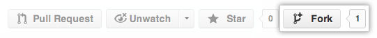

Developing TARDIS
=================

Welcome to the Development guide to TARDIS. It’s preferred to read out
the `documentation pages. <https://tardis-sn.github.io/tardis/>`__
Consider the following Steps to develop
`Tardis <file:///home/harpreet/Tardis_sn/tardis/docs/_build/html/index.html>`__.

Step.1: Configuring a GitHub Account:
~~~~~~~~~~~~~~~~~~~~~~~~~~~~~~~~~~~~~

Create a `GitHub Account <https://github.com/>`__ if you don’t have one
and configure your account to allow write access. You can see how to
`Generate SSH
keys <https://help.github.com/en/github/authenticating-to-github/connecting-to-github-with-ssh>`__.

Step.2: Creating you own fork of the Repository:
~~~~~~~~~~~~~~~~~~~~~~~~~~~~~~~~~~~~~~~~~~~~~~~~

Fork the ``tardis-sn/tardis`` repository to your account. You can use
the below instructions:

1. Log into your `GitHub <https://github.com/>`__ Account
2. Go to the `TARDIS GitHub <https://github.com/tardis-sn/tardis>`__
   home page.

3. Click on the fork button at upper left side of the screen.

Step.3: Setting up the fork to work on:
~~~~~~~~~~~~~~~~~~~~~~~~~~~~~~~~~~~~~~~

1. Clone the repository you forked to the local computer using command:

::

   git clone git@github.com:your-user-name/tardis.git

2. cd to the new Repository:

::

   cd tardis

3. Then type the following command:

::

   git branch -a

4. In order to show you all branches. You’ll get something like:

::

   * master
   remotes/origin/maste

Above tells you the current branch you are on i.e. master, and that you
also have a remote connection to ``origin/master``. Try this command to
see the URLs for the remote connections. They will point to your GitHub
fork:

::

   git remote -v

4. Merging changes from the trunk:

::

   git remote add upstream git://github.com/tardis-sn/tardis.git

5. Type the following command to show the remote connection:

::

   git remote -v show

You’ll get output like this.

::

   upstream   git://github.com/tardis-sn/tardis.git (fetch)
   upstream   git://github.com/tardis-sn/tardis.git (push)
   origin     git@github.com:your-user-name/tardis.git (fetch)
   origin     git@github.com:your-user-name/tardis.git (push)

If you get prompted like this your fork is set up correctly.

Installing TARDIS in develop mode
---------------------------------

TARDIS can easily be used directly out of the source tree by using
``Import`` when running python in the source of an Tardis repository
clone. In order to install TARDIS in develop mode use the following
command:

::

   python setup.py develop

Above code semi-permanently installs TARDIS on your path in such a way
that ``tardis`` is always imported from the clone repository regardless
of your working directory, which benifits in immediate availability of
the code edits in your repo next time you start a Python interpreter and
``import tardis``

For pure users it’s recommended to install TARDIS for the latest
development version:

::

   pip install git+https://github.com/tardis-sn/tardis

Alternatively, you can manually clone the repository and install TARDIS
by:

::

   git clone https://github.com/tardis-sn/tardis.git
   cd tardis
   python setup.py install

Enabling parallel execution with OpenMP
---------------------------------------

Cloning the repository manually enables other options also such as:
``ruiing code in parallel`` (enabling OpenMP).Within the Tardis
development environment run:

::

   conda install -c conda-forge compilers

For macOS:

::

   conda install -c conda-forge llvm-openmp

For Linux:

::

   conda install -c conda-forge openmp

Now in order to compile TARDIS for parallel execution run:

::

   python setup.py install --with-openmp

That’s all with the Development guide. Consider the development
guidlines they can be found
`here. <https://tardis-sn.github.io/tardis/development/index.html>`__
Next you’ll see how to exacly **run TARDIS**.
