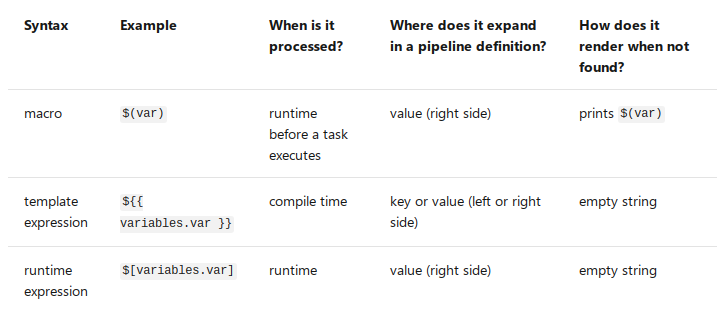

**********************
Continuous Integration
**********************

We use a so-called `continuous integration`_ workflow with TARDIS.
This means that each time a change is proposed (via pull request)
or a change is merged into the *master* branch, a service will
clone the repository, checkout to the current commit and execute
all the TARDIS tests. This helps us to detect bugs immediately.

Azure Pipelines
===============

Currently, we use the `Azure DevOps`_ service to run most of our
pipelines. The following section explains briefly the different
components of a pipeline.

Repos
-----

Azure Repos is just another service to store Git repositories.
Currently, we use Azure Repos to mirror ``tardis-refdata``
repository since Azure does not impose limits on LFS bandwith
nor storage. We should sync this mirror every time reference
data is updated on GitHub.

**To clone this repository:**
::
  git clone https://tardis-sn@dev.azure.com/tardis-sn/TARDIS/_git/tardis-refdata

**To download a LFS file trough HTTPS:**
::
  https://dev.azure.com/tardis-sn/TARDIS/_apis/git/repositories/tardis-refdata/items?path=atom_data/kurucz_cd23_chianti_H_He.h5&resolveLfs=true

YAML files
----------

A pipeline is essentially a YAML configuration file with different
sections such as variables, jobs and steps. Unlike other services
such as GitHub Actions, pipelines on Azure must be created through
the web UI for the first time. Then, making changes to an existing
pipeline is as easy as making a pull request.

Triggers
--------

First thing to do is telling the pipeline when it should run.
*trigger* (also known as the CI trigger) sets up the pipeline to
run every time changes are merged to the *master* branch.
::
  trigger: 
    - master

If some trigger is not specified then the default configuration
is assumed.
::
  trigger:
    branches:
      include:
      - '*'

  pr:
    branches:
      include:
      - '*'

This means the pipeline will start running every time changes are 
merged  to any branch of the repository, or someone pushes new
commits to a pull request.

If you want to run a pipeline only manually set both triggers to 
*none*.
::
  trigger: none

  pr: none

Notice that you can test changes in a pipeline by activating the PR
trigger on a new pull request, even if that trigger is disabled on
the YAML file present in the *master* branch.

There are more useful triggers such as the *cron* trigger, see the 
`Azure documentation section on triggers`_ for more information.

.. warning:: Triggers also can be set on the Azure's web interface 
          too, but this action is discouraged, since it overrides
          any trigger specified in the YAML file and could lead to
          confusing sitations.

Variables
---------

Variable syntax
***************

Azure Pipelines supports three different ways to reference variables:
*macro*, *template expression*, and *runtime expression*. Each syntax
can be used for a different purpose and has some limitations.

**What syntax should I use?** Use *macro syntax* if you are providing
input for a task. Choose a *runtime expression* if you are working with
conditions and expressions. If you are defining a variable in a template,
use a *template expression*.

Define variables
****************

Usually, we define variables at the top of the YAML file.
::
  variables:
    my.var: 'foo'

  steps:
    - bash: |
        echo $(my.var)

When a variable is defined at the top of a YAML, it will be available
to all jobs and stages in the pipeline as a *global variable*.
Variables at the *stage* level override variables at the *root* level,
while variables at the *job* level override variables at the *root* 
and *stage* level.

Also, variables are available to scripts through environment variables.
The name is upper-cased and ``.``  is replaced with ``_``. For example::
  variables:
    my.var: 'foo'

  steps:
    - bash: |
        echo $MY_VAR

To set a variable from a script task, use the ``task.setvariable`` logging
command.
::
  steps:

    - bash: |
        echo "##vso[task.setvariable variable=my.var]foo"

    - bash: |
        echo $(my.var)

See the `Azure documentation section on variables`_ for more information.

Predefined variables
--------------------

The most important (and confusing) predefined variables are the ones related
to paths in Azure:

* All folders for a given pipeline are created under ``Agent.BuildDirectory`` 
  variable, alias ``Pipeline.Workspace``. This includes subdirectories like
  ``/s`` for sources or ``/a`` for artifacts.

* Path to source code varies depending on how many repositories we fetch.
  For example, source code is located under the ``Build.Repository.LocalPath``
  variable (alias ``Build.SourcesDirectory``) when fetching a single repository,
  but after fetching a second repository code is moved automatically to
  ``Build.Repository.LocalPath/repository-name``.

See the Azure documentation to learn more about `checking out multiple repositories`_.

Azure provides a list of agent hosts that can run the pipeline on a virtual machine. In our pipelines, we
use the vm_Images: Ubuntu 16.04 and macOs-10.14.

Jobs
----

You can organize your pipeline into jobs. Every pipeline has at least one job.
A job is a series of steps that run sequentially as a unit. In other words,
a job is the smallest unit of work that can be scheduled to run.
::
  jobs:
  - job: myJob

    pool:
      vmImage: 'ubuntu-latest'

    steps:
    - bash: echo "Hello world"

Jobs can run in parallel (for example: run the same job on multiple OSes) or
depend on a previous job.

See the `Azure documentation section on jobs`_ for more information.

.. include:: git_links.inc
.. include:: azure_links.inc

Templates
---------

Templates let you define reusable content, logic, and parameters. It functions
like an include directive in many programming languages (content from one file
is inserted into another file).

See the `Azure documentation section on templates`_ for more information.

TARDIS Pipelines
================

Already implemented on Azure or GitHub Actions.

Default template
----------------

The common set of steps used across most TARDIS pipelines now lives in the
"default" template.

- Use ``set -e`` on Bash steps.
- Set custom variables.
- Fetch TARDIS main repository.
- Fetch TARDIS reference data repository (optional).
- Configure Anaconda for Linux and macOS agents.
- Install Mamba package manager (optional).
- Install TARDIS environment (optional).
- Build and install TARDIS (optional).

It was written to make pipelines easier to create and mantain. For example,
to start a new pipeline use::

  steps:
    - template: templates/default.yml
      parameters:
        fetchRefdata: true

**List of template parameters:**

- ``fetchRefdata``: fetch the ``tardis-refdata`` repository from Azure Repos
  (default is *false*).
- ``useMamba``: use the ``mamba`` package manager instead of ``conda``
  (default is *false*). 
- ``skipInstall``: does not create the TARDIS environment
  (default is *false*).

**List of predefined custom variables:**

- ``tardis.dir`` is equivalent to ``$(Build.SourcesDirectory)/tardis``.
- ``refdata.dir`` is equivalent to ``$(Build.SourcesDirectory)/tardis-refdata``.

Testing pipeline
----------------

The `testing pipeline`_ (CI) consists basically in the same job running twice
in parallel (one for each OS) with the steps from the default template, plus
extra steps to run the tests and upload the coverage results.

Documentation pipeline
----------------------

Builds and deploys the TARDIS documentation website. Currently, we are
using GitHub Actions for this purpose.

Zenodo JSON pipeline
--------------------

This pipeline runs a notebook located in ``tardis-zenodo`` repository and
pushes a new version of ``.zenodo.json`` to the root of ``tardis``
repository if new commiters are found (or author order changes). The
rendered notebook is uploaded to the pipeline results as an artifact.

.. warning :: Fails if some author name is incomplete (due to an incomplete
          GitHub profile) or duplicated (commited with more than one 
          email adress). In both cases update ``.mailmap`` to fix it.

In the near future we want to auto-update the citation guidelines in the
``README.rst`` and the documentation.

Release pipeline
----------------

Publishes a new release of TARDIS every sunday at 00:00 UTC. 

Reference data pipeline
-----------------------

Generates new reference data according to the changes present in the
current pull request. Then, compares against reference data present in the
head of ``tardis-refdata`` repository by running a notebook. Finally, uploads
the rendered notebook to the pipeline results.

To trigger this pipeline is necessary to leave a comment in the GitHub pull
request.
::
  /AzurePipelines run TARDIS refdata

For brevity, you can comment using ``/azp`` instead of ``/AzurePipelines``.
