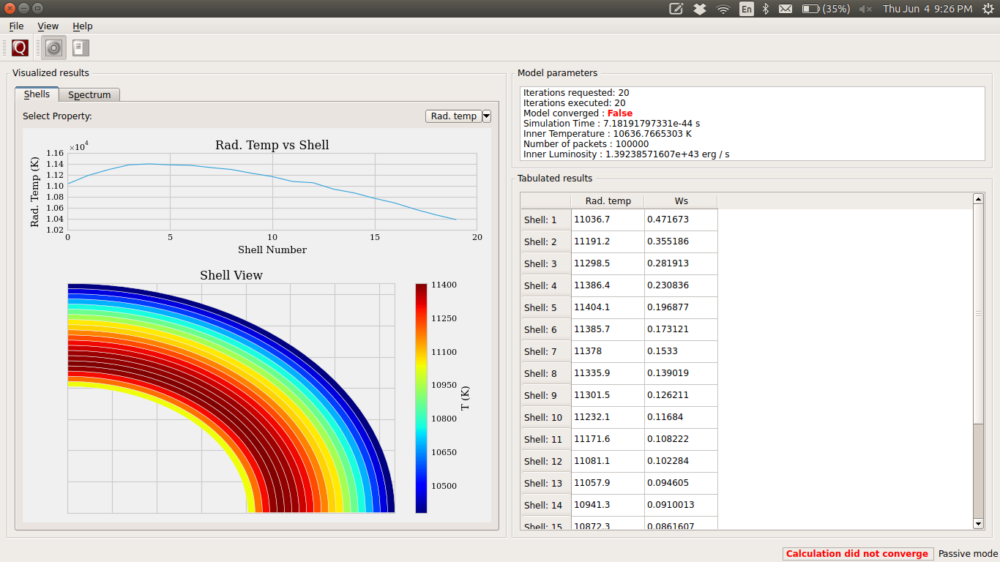
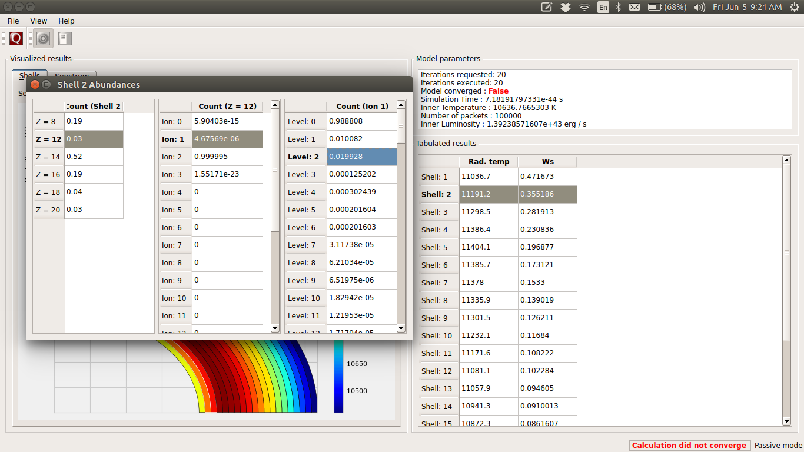
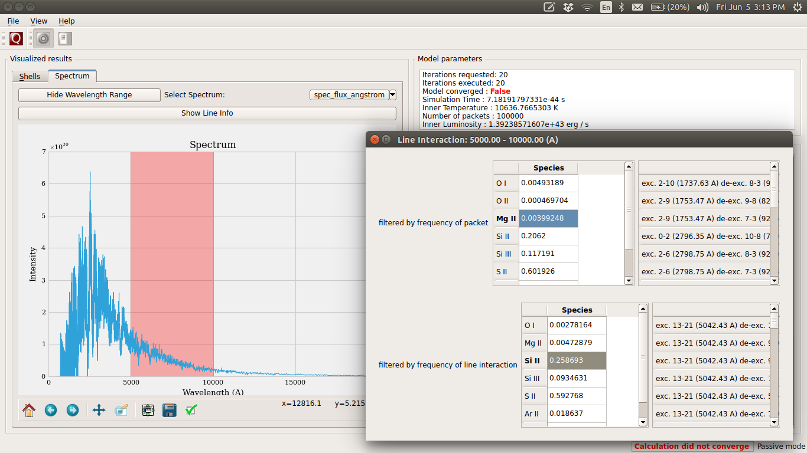

************************
Graphical User Interface
************************

TARDIS uses the `PyQt4 framework <http://www.riverbankcomputing.com/software/pyqt/download>`_ for its cross-platform
interface.

The GUI runs through the `IPython Interpreter <http://ipython.org/install.html>`_ which should be started with the
command ``ipython --pylab=qt4``, so that it has acess to pylab.

Creating an instance of the :class:`ModelViewer`-class requires that PyQt4/PySide has already been initialized in
IPython. The above command to start IPython accomplishes this.

gui.py contains all the classes used to create the GUI for Tardis.

This module must be imported inside IPython console started above. The console provides the event loop and the place
to create/calculate the tardis model. So the module is basically a tool to visualize results. 

Running instructions
--------------------
Decide which Qt binding you want to use (PySide or PyQt) and 
accordingly set QT_API in shell::

    export QT_API=pyside
    or:
    export QT_API=pyqt
        
Start the IPython console with eventloop integration::

    ipython --pylab=qt4
        
Display your model::

    from tardis import gui 
    win = gui.Tardis()
    win.show_model(mdl)

GUI Layout and Features
-----------------------
When you launch the gui the first screen that you see will be something like the snapshot below. 
    

Shell Info
~~~~~~~~~~
You can inspect the plot of shells on the first window you see and use the toggle button to see the 
plot of dilution factor and the radiation temperature in shells.

To see the abundances in a shell double-click on the shell number in the table. You can follow a 
similar strategy in the tables that appear to bring up the ion and level populations for each shell.
The snapshot below shows all the tables that you can bring up by successively clicking the horizontal
table headers. 

Line Info
~~~~~~~~~
If you switch to the spectrum tab you can see the spectrum plot and a button to show line info.
Once again you can double-click the table headers to get further information. The snapshot below
shows all the tables that you can bring up in this window.

