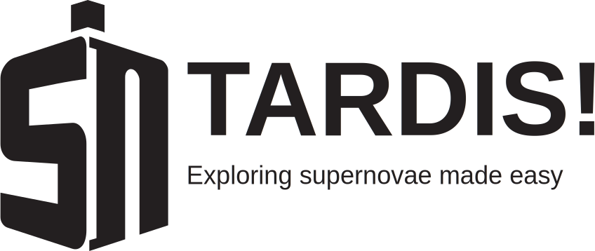

..
  .. image:: graphics/tardis_logo.jpg

.. the "raw" directive below is used to hide the title in favor of just the logo being visible
.. .. raw:: html

..    

##################################
Tardis Core Package Documentation
##################################

.. raw:: html

   

.. _tardis:

TARDIS is an open-source Monte Carlo radiative-transfer spectral synthesis code
for 1D models of supernova ejecta. It is designed for rapid spectral modelling
of supernovae. If you use this code for any publications or presentations please
acknowledge it by citing :cite:`Kerzendorf2014`.

============
Using Tardis
============

.. toctree::
    :maxdepth: 2

    installation
    quickstart
    running/index
    examples/index
    scripts/index
    credits

======================
Looking under the hood
======================

.. toctree::
    :maxdepth: 2

    atomic/atomic_data
    physics/index
    montecarlo/index

=================
Developing Tardis
=================

.. toctree::
    :maxdepth: 2

    issues
    workflow/development_workflow
    runnints_tests
    changelog

==========
References
==========

.. toctree::
    zreferences

====
News
====

.. include:: news.rst

