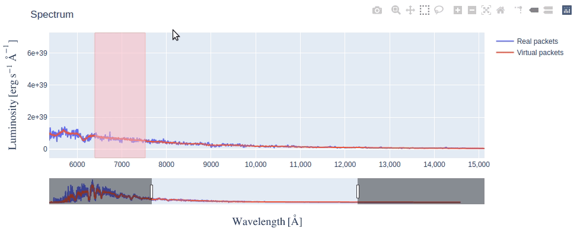

********************
Using TARDIS Widgets
********************

This page describes what each TARDIS Widget has to offer and how you can make
the best use of it. If you're looking for the code to generate widgets, head
over to `Generating Custom Abundance Widget <how_to_abundance_widget>`_ section or 
`Generating Data Exploration Widgets <how_to_generating_widgets>`_ section to see the
notebook in action.

Currently, TARDIS supports the following widgets:

Custom Abundance Widget
#######################
This widget (or GUI) allows you to develop custom model compositions 
graphically and output the model to a new file.

.. image:: ../images/custom_abundance_widget.png
    :alt: Demo of Custom Abundance Widget

The GUI consists of three parts:

1. **Visualization plot** - An interactive step graph that shows abundances 
and densities as a function of velocity. 

2. **Data editor** - An interface to edit abundances, densities and velocity 
shells.

3. **File output** - An output module to save the model compositions as a CSVY 
file.

Interacting with the GUI
========================

You can interact with this GUI in the following ways:

Edit Abundances
---------------
There are two radio buttons which allow you to edit either single shell or 
mutiple shells. The new input will be applied to selected shell(s) immediately 
and the plot is updated at the same time. If you want to edit multiple shells 
at a time, remember to choose the second radio button and set the range of 
shell number using int slider. The selected shell(s) is highlighted in the 
plot.

Normalize Abundances
--------------------
Click `Normalize` button to normalize the abundances on selected shell(s) to 
1. If you wish to keep the abundance of a certain element unchanged during the 
normalization, you can select the checkbox near that element to lock it. 
The normalization will be applied to other elements and the sum of the 
abundances still remains at 1.

Edit Densities
--------------
In `Edit Density` tab, you also can edit either single shell or the whole 
density profile. To calculate a new profile, you need to choose the density 
type and input required parameters.

Add New Element
---------------
At the bottom of the editor, the symbol input box allows you to add new element 
or isotope to the model. It automatically recognizes whether the symbol exists 
or whether the element is already in the model.

Add New Shell
-------------
Another important functionality is to add new shell to the model. You need to 
specify the velocity range of the new shell and abundances at that new shell 
will be set to 0. Note that the existing shell(s) will be resized smartly if 
the new shell overlaps with it.

Shell Info Widget
#################

This widget allows you to explore the chemical abundances in different shells
of the model Supernova ejecta.

.. image:: ../images/shell_info_widget_demo.gif
    :alt: Demo of Shell Info Widget

It consists of four interlinked tables - clicking on any row in a table,
populates data in the table(s) to the right of it. Each table has the
following information:

1. **Shells Data** - Radiative temperature and Dilution Factor (W) of each shell
(computational partitions) of the model Supernova ejecta. Shell numbers are
given in ascending order, from the innermost shell to the outermost.

2. **Element Abundances** - Fractional mass abundance of each element present
in the selected shell.

3. **Ion Abundances** - Fractional mass abundance of each ion (species) of the
selected element present in the selected shell. 

4. **Level Abundances** - Fractional mass abundance of each level of the
selected ion and element in the selected shell.

Line Info Widget
################

This widget lets you explore the atomic lines responsible for producing
features in the simulated spectrum.

.. image:: ../images/line_info_widget_demo.gif
    :alt: Demo of Line Info Widget

By selecting a wavelength range on the spectrum plot, you can see the species
that produced the features within that range. This is determined by counting
the number of escaping packets that experienced their last interaction with
each species. Packets can be filtered by the wavelength at which they were
absorbed or emitted, using the toggle buttons.

You can then click on a species to see the packets count for each last line
interaction it experienced. Using the dropdown menu, these counts can be grouped
by excitation lines, de-excitation lines, or both.

Interacting with Spectrum
=========================

The spectrum in the Line Info Widget is an interactive figure made using
`plotly <https://plotly.com/python/>`_, there are several things you can
do with it:

Making Selection
----------------
The box selection is enabled by default, so you just need to click and drag on
the figure and a pink colored selection box will appear. By making a
selection across the wavelength range you're interested in, tables update
to show line information of only packets from that range.

.. image:: ../images/line_info_spectrum_selection.gif
    :alt: Demo of making selection

After making a selection, if you need to resize the selection box (say, make it
narrower), simply redraw a new selection box over the older one.

Using Rangesilder
-----------------
The rangeslider is a long bar below the figure that allows you to zoom in on a
particular wavelength range in the long spectrum.

Either you can **slide** the zoomed range by clicking and dragging it or you 
can **resize** it by dragging the handles (vertical bars) at its edges.

Using other options in Modebar
------------------------------
If you take your mouse to the top right corner of the figure, you will see a
Modebar with multiple options. The default option when Line Info Widget first
displays is **Box Select** - the dotted square icon. You can click on other
options like **Zoom** (magnifying glass icon), to do a rectangular zoom which
may be helpful to focus on a feature in the spectrum. You can always revert
back to the initial state of the figure by clicking on **Reset Axes** option.

.. image:: ../images/line_info_spectrum_modebar.gif
    :alt: Demo of using modebar options

There are also several other options in the modebar which we have not explained
(because they are not very relevant) but you're free to explore them as long as
you remember to click back on the **Box Select** option for making selections on
spectrum.

Energy Level Diagram
################

This widget lets you visualize the last line interactions

By selecting an ion on the widget, you can see its energy level diagram, which
also shows information about the last line interactions experienced by packets
in the simulation.

The y-axis of the plot represents energy while the horizontal lines show
discrete energy levels. The thickness of each line represents the level
population, with thicker lines representing a greater population than the thin lines.

Arrows represent the line interactions experienced by packets. Upwards arrows
show excitation from lower energy levels to higher levels and downward arrows
show de-excitation from higher energy levels to lower levels. The thickness of
each arrow represents the number of packets that underwent that interaction,
with thicker lines representing more packets than the thin lines.
The wavelength of the transition is given by the color.

Setting Other Options
-----------------
You can select the range on which to filter the wavelength using the slider.
You can also select the model shell by which to filter the last line interactions
and the level populations. If no shell is selected, then all the last line
interactions are plotted and the level populations are averaged across all shells
in the simulation. You can also set the maximum number of levels to show on the plot.

Lastly, you can also set the scale of the y-axis: Linear or Log.

.. image:: ../images/energy_level_widget_options.gif
    :alt: Demo of using options

.. Toggle legend
