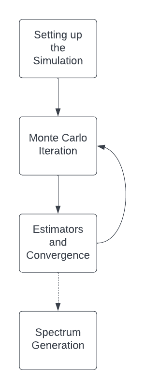

.. _walkthrough:

********************************
Physics Walkthrough Introduction
********************************

How TARDIS Works
================

The goal of TARDIS is, given input information about a supernova, to determine (i) properties of the plasma making up the supernova and (ii) the spectrum of light that is emitted from the supernova.

The physics of TARDIS is in four major parts, which are summarized here and in the diagram below. First, the TARDIS simulation is set up (:doc:`../setup/index`). This involves the creation of the supernova model and the initial conditions of the supernova's plasma. Next is the Monte Carlo Iteration (:doc:`../montecarlo/index`) where the heart of TARDIS takes place; packets of light are sent through the supernova and tracked as they interact with matter. Next, TARDIS uses information from the Monte Carlo iteration to update properties of the plasma to eventually find the correct plasma state (:doc:`../est_and_conv/index`). This process of doing a Monte Carlo iteration and then updating the plasma is repeated for a specified number of times or until certain aspects of the plasma state converge (as is discussed in :ref:`convergence`). After that, data generated in the Monte Carlo simulation is used to synthesize the output spectrum of the supernova (:doc:`../spectrum/index`).

Background Material
===================

TARDIS is home to an incredibly diverse, multidiciplinary team. As such, we believe that it is important to make an understanding of the physics of TARDIS accessible to all, from students just getting started with physics and astronomy to expert researchers. The following pages are designed to give an overview of the basic physics that TARDIS relies upon to new students or anyone else in need of a refresher!

.. toctree::
    light_and_matter