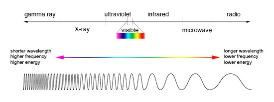
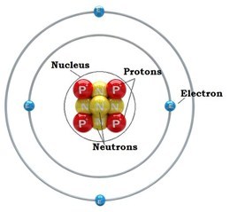
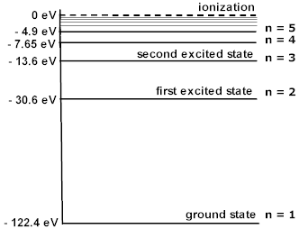
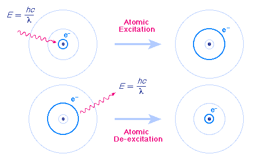
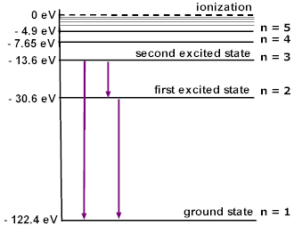
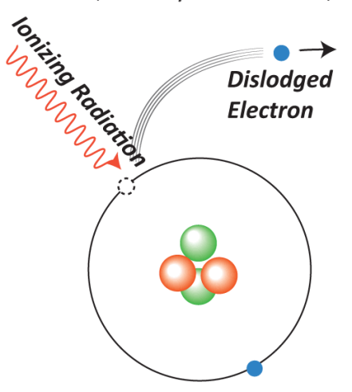
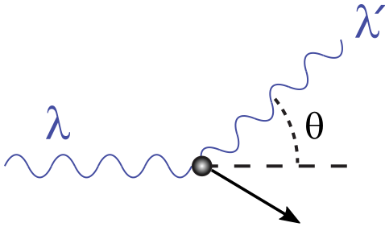

.. _light_and_matter:

************************************
Light, Matter, and How They Interact
************************************

Given that TARDIS tracks light as it travels through the ejecta of a supernova, one of the most fundamental pieces of physics used in TARDIS is what light and matter are, and how they interact.

Light
=====

In the early 1900s, it was `shown <https://webs.morningside.edu/slaven/Physics/uncertainty/uncertainty2.html>`_ that light exhibits properties of both particles and waves. Like a particle, light comes in discrete units called photons, which could be understood as the "particle of light." Light is then just a collection of photons traveling through space. These photons each have an energy and momentum like any other particle. However, like a wave, light (and thus photons) has a frequency and a wavelength. Photons can thus be thought of as discrete units of a light wave with a certain wavelength and frequency.

The energy :math:`E` of a photon is related to its frequency :math:`\nu` by the relation

.. math:: E = h\nu

where :math:`h` is Planck's constant. Thus a light made up of :math:`N` photons of frequency :math:`\nu` will have a total energy of :math:`Nh\nu`. Additionally, since light travels at the "speed of light" :math:`c`, approximately 300,000,000 meters per second, basic wave mechanics tells us that the wavelength :math:`\lambda` and frequency :math:`\nu` of light/photons are related by

.. math:: \lambda\nu=c

and thus :math:`\nu=c/\lambda` and :math:`\lambda=c/\nu`. These relations tell us that light with a lower frequency will have a lower amount of energy per photon and a longer wavelength, and light with a higher frequency will have a higher amount of energy per photon and a shorter wavelength.

Light can then be classified by its frequency/wavelength on the electromagnetic spectrum, shown below. To the left is light with higher energy/higher frequency/shorter wavelength, and to the right is light with lower energy/lower frequency/longer wavelength. Notice visible light as a small branch of the spectrum, which ranges from a wavelength of about 400 nm (violet) to 700 nm (red). Because red is on the lower frequency/longer wavelength side of the visible light spectrum, we say if some light has a lower frequency/longer wavelength compared to other light, it is called "redder." Conversely, because blue is on the higher frequency/shorter wavelength side of the visible light spectrum, we say if some light has a higher frequency/shorter wavelength compared to other light, it is called "bluer."

    Image from https://imagine.gsfc.nasa.gov/science/toolbox/emspectrum1.html.

.. note::
    A common unit of wavelength used in astronomy is the Angstrom (:math:`\r{A}`), which is equal to :math:`10^{-10}` meters. Visible light consists of wavelengths between 4000 and 7000 Angstroms.

Matter
======

The other main ingredient of the physics of TARDIS is matter. Strictly speaking, matter is anything that has mass and takes up space. However, in supernovae as well as in every-day life (this is no coincidence -- everything on Earth came from the remnants of supernovae), matter refers to atoms and the particles that make them up. Atoms are, in that sense, the basic building block of matter. They are composed of three particles: protons, neutrons, and electrons. The protons and neutrons are found in the center of the atom, called the nucleus, and the electrons surround the nucleus, as shown in the figure below. Note that while electrons are often shown as orbiting the nucleus, this is not strictly true (see `atomic orbitals <https://en.wikipedia.org/wiki/Atomic_orbital>`_). However, it is still a useful way to think of atoms for our purposes.

    Image from https://alevelchemistry.co.uk/notes/atomic-structure-and-periodic-table/.

Protons are positively charged particles with a charge of one elementary charge unit (e, about :math:`1.6\times 10^{-19}` Coulombs) and a mass of one atomic mass unit (amu, about :math:`1.66\times 10^{-24}` grams). Atoms are classified into elements on the `periodic table <https://en.wikipedia.org/wiki/Periodic_table>`_, based on the number of protons. For example, an atom with one proton is Hydrogen, an atom with two protons is Helium, and so on. In this way, the number of protons determines the identity of the atom.

Neutrons are electrically neutral particles with roughly the same mass as a proton (1 amu). Protons and neutrons are far heavier than electrons, so the total mass of an atom in atomic mass units is roughly the number of protons plus the number of neutrons. Neutrons control the stability of atoms -- for example, Helium with 2 protons and 2 neutrons, called Helium-4, is stable; while Helium with 2 protons and 3 neutrons, called Helium-5, is highly unstable. Atoms of the same type (number of protons) but different numbers of neutrons (different masses) are called **isotopes**. Unstable isotopes will decay into more stable isotopes either of the same type of atom or a different type of atom (see `radioactive decay <https://en.wikipedia.org/wiki/Radioactive_decay>`_). This decay process helps power supernovae.

The final part of atoms, electrons, are negatively charged with a charge of -1 e, the opposite of a proton. Their mass, as previously mentioned, is very small in comparison to protons and neutrons, less than 1/1800 of an amu. The number of electrons determines the overall electrical charge of the atom. For example, helium with 2 protons and 2 electrons will have a net neutral charge, but helium with 2 protons and 3 electrons will have a net charge of -1e. Atoms with unequal numbers of protons and electrons, and thus a non-neutral electrical charge, are called **ions**. In TARDIS, we generally deal with ions with more protons than electrons, called cations, which will have an overall positive charge. The "ion number" refers to how many more protons there are than electrons -- i.e. neutral Helium with 2 protons and 2 electrons would have an ion number of 0, and Helium with 2 protons and 0 electrons, which would have a charge of +2e, has an ion number of 2.

.. note::

    Often in astronomy, Roman numerals are used to denote ion number. Confusingly, an ion number of 0 is denoted by ``I``, an ion number of 1 is denoted by ``II``, and so on.

Now, the electrons that are *bound to atoms* have very particular energies that they are allowed to have -- no other energies are allowed. These are called energy levels, or simply **levels**. An energy level diagram for lithium with a single electron (lithium III, with ion number 2) is shown below. Roughly, these energy levels have to do with how far away the electron is from the nucleus; a higher energy means farther away, a lower energy means closer together. By convention, an electron infinitely far away from the nucleus has zero energy, and all others have a negative energy.

    Image from http://dev.physicslab.org/Document.aspx?doctype=3&filename=AtomicNuclear_EnergyLevelDiagrams.xml.

As we will see in the following section, electrons are the main part of an atom responsible for light-matter interactions.

Light-Matter Interactions
=========================

Now that we have discussed light and matter, we can focus on how the two interact. For our purposes, this occurs in three main ways: line interactions, ionization, and electron scattering.

Excitation (bound-bound interactions)
-------------------------------------

The first type of light-matter interaction occurs when a photon carrying some energy :math:`E` is absorbed by an electron bound to an atom at an energy level :math:`l` with energy :math:`E_l`, and the electron "jumps" to a higher energy level :math:`u` with energy :math:`E_u` (:math:`l` meaning "lower" and :math:`u` meaning "upper"), as in the diagram below. We say that the electron is **excited** from the lower to higher energy level, and that it goes through a **transition** :math:`l\rightarrow u`. For this to happen, the photon has to have an energy equal to the difference between the two energy levels involved. That is, for an electron to be excited from :math:`l` to :math:`u`, it will gain an energy :math:`E_u-E_l` and thus the photon exciting the electron must have an energy :math:`E_u-E_l` and therefore a frequency :math:`\frac{E_u-E_l}{h}`.

An electron in a higher energy level :math:`u` can also de-excite to a lower energy level :math:`l`, *releasing* a photon of energy :math:`E_u-E_l` and frequency :math:`\frac{E_u-E_l}{h}` (this would be notated as :math:`u\rightarrow l`). Note that if an electron is excited :math:`l\rightarrow u`, it need not de-excite back to the energy level :math:`l` where it began. It could de-excite to any level with a lower energy than :math:`E_u`.

    Image from http://www.pas.rochester.edu/~blackman/ast104/bohr.html.

Since energy levels are discrete, excitation can only be caused by certain frequencies of light. Specifically, it is caused by photons with an energy that equals the difference between two electron energy levels. The various energies/frequencies allowed to cause an excitation are called atomic **lines**, and thus excitation is frequently referred to as a **line interaction**. A photon with the right frequency to induce a line interaction (i.e. for the transition :math:`l\rightarrow u` this frequency would be :math:`\frac{E_u-E_l}{h}` as before), we say that the photon **resonates** with the line. Three atomic lines are shown below, again for Lithium with a single electron, represented by arrows connecting the energy levels (specifically, these arrows show a few possible transitions :math:`u\rightarrow l`). Note that transitions between any other pair of levels are also allowed atomic lines, though they are not explicitly shown on the diagram.

    Image from http://dev.physicslab.org/Document.aspx?doctype=3&filename=AtomicNuclear_EnergyLevelDiagrams.xml.

Note that these are sometimes called bound-bound interactions, since the electron starts bound to an atom and ends bound to the same atom.

Ionization (bound-free interactions)
------------------------------------

The next type of interaction is called ionization. This is when a photon interacts with an electron and gives the electron enough energy to escape from the atom, as shown in the diagram below. Unlike line interactions, the final energy of the electron is not restricted to discrete energy levels since the electron is not bound to an atom. The difference in energy :math:`E_f-E_i` of the electron can be anything above the ionization energy :math:`E_\mathrm{ion}`, or the minimum energy it takes to ionize the atom. This energy can be seen as the difference between the initial energy level and the dotted line labeled "ionization" on the energy level diagrams above. So, an ionizing photon can have any frequency greater than or equal to :math:`\frac{E_\mathrm{ion}}{h}`. Note that this is called ionization because the final atom is missing an electron and is thus an ion.

    Image from https://idahoaskascientist.com/2016/01/08/why-are-gamma-rays-more-harmful-than-radio-waves/.

Ionization is also called a bound-free interaction, since the electron starts bound to an atom and ends up not bound to an atom (i.e. free).

Note that just like with de-excitation, ionization can be "reversed" through **recombination**. This is where any free electron (not necessarily one that was ionized off the particular atom) becomes bound to an atom (recombines with the atom). The electron's energy is lowered to one of the energy levels of the atom, and a photon is released with an energy equal to the amount of energy the electron loses in the recombination process.

Electron Scattering
-------------------

The final type of interaction is electron scattering. This is when a photon collides with a free electron, which then, like any two particles colliding, sends the electron and the light off in different directions in accordance with the `conservation of momentum <https://www.physicsclassroom.com/class/momentum/Lesson-2/Momentum-Conservation-Principle>`_. This is shown in the diagram below. If the electron is moving far slower than the speed of light, this is called `Thomson scattering <https://en.wikipedia.org/wiki/Thomson_scattering>`_, and the wavelength, frequency, and energy of the photon remains the same before and after the collision. If the electron is moving close to the speed of light, `relativity <https://en.wikipedia.org/wiki/Special_relativity>`_ kicks in, and we have `Compton scattering <https://en.wikipedia.org/wiki/Compton_scattering>`_ in which the wavelength, frequency, and energy of the photon will change after the collision. In Thomson scattering, photons of any frequency have the same likelihood of scattering with an electron. In Compton scattering, while any photon of any frequency can scatter, the likelihood of scattering depends on the frequency of the photon.

    Image from https://en.wikipedia.org/w/index.php?title=File%3ACompton-scattering.svg.

.. _opacity:

Opacity and Optical Depth
=========================

Consider the following experiment -- you fill a clear glass of water completely, shine a light down on it, and look through the bottom of the glass. Then, you drink half of the cup, and repeat. The light coming out from the bottom will be brighter. This is because as light travels through the water, it has a probability of interacting with the matter that makes up the water, and the longer it travels in the water, the more likely it is for the light to interact and thus not come out the other side.

This is described by the Beer-Lambert law, which says that the intensity :math:`I` of light (related to how bright the light is -- more on this soon) after traveling a distance :math:`d` through some material is related to the initial intensity :math:`I_0` of the light before traveling through the material by

.. math:: \frac{I}{I_0} = e^{-\alpha d}

where :math:`\alpha` is called the **opacity**. Note that for our purposes, the intensity at some frequency is proportional to the number of photons at that frequency, so :math:`\frac{I}{I_0}` is the fraction of photons who enter the material who do not interact and thus make it out the other side. Note that the opacity can and typically does depend on the frequency of light, which is why we frequently interpret Beer-Lambert's law as applying to a specific frequency.

We can interpret this in the following way: prior to traveling a distance :math:`d`, a photon will have had a :math:`e^{-\alpha d}` probability of *not* interacting with matter (and thus a :math:`1-e^{-\alpha d}` probability of having gone through an interaction). As you would expect, the larger the distance, the more likely it is that a photon interacts prior to traveling that distance, since it would have "more opportunities" to interact. Additionally, a higher :math:`\alpha` means a photon has a higher likelihood of interacting. So, more dense materials, for example, have a higher :math:`\alpha` since there is more matter for the light to interact with. Because :math:`\alpha` must take into account all three types of light-matter interactions, many of which depend on the frequency of light, it can be very difficult to calculate -- this is one of TARDIS's main tasks.

Finally, the term :math:`\alpha d` has a special name: the **optical depth** :math:`\tau`. It is a dimensionless quantity that gives information about how likely it is for a photon to have gone through an interaction. Specifically, there is a :math:`1-e^{-1}\approx 63.2\%` of a photon interacting prior to traveling an optical depth of 1. The actual distance required to travel and optical depth of 1 depends on :math:`\alpha` and thus the material and the frequency of the light.
