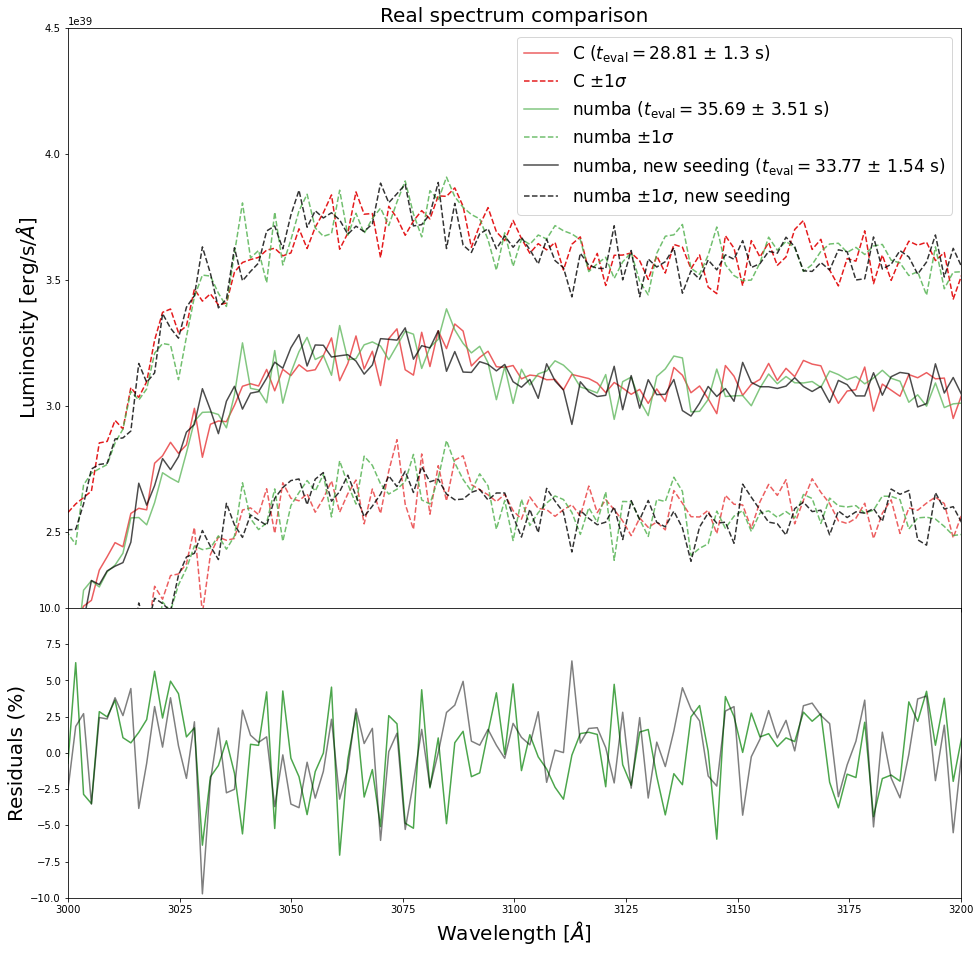
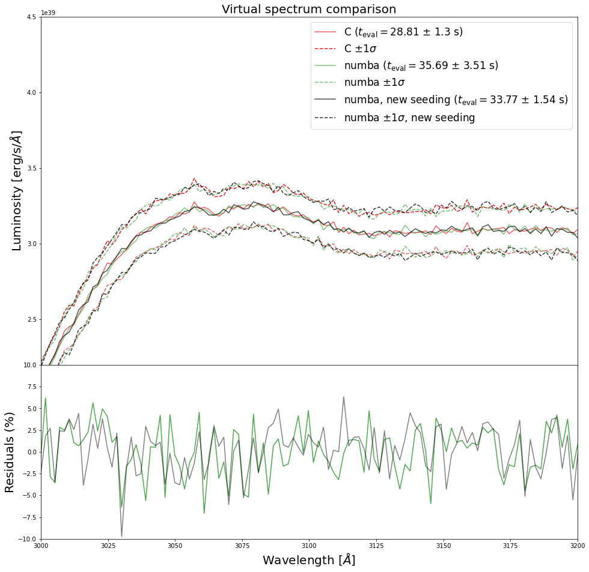

****************
Numba in TARDIS
****************
In order to maximize mantainability and extensibilty without sacrificing
performance, TARDIS makes use of [Numba](https://numba.pydata.org/numba-doc/dev/reference/pysupported.html)
within its Monte Carlo procedures. With Numba, we are able to "just-in-time" (JIT)
compile our Python code, enabling portions of it to run near machine code speed.

Running single packets
=======================
One benefit of transitioning to Numba is that, in the new implementation of
our Monte Carlo processes, we can run single packets at a time in a
reproducible manner. This would allow for more concerted debugging efforts,
especially when paired with an IDE such as PyCharm when adding featured to
TARDIS. In addition, it will enhance future visualization efforts.

Seeding strategy
=================
When the user specifies a montecarlo_seed in the YML configuration, that seed
is used to pseudo-randomly generate a list of packet seeds, in addition to
generating packet properties (frequencies, energies, and trajectory angles).
Packet seeds are set before each packet makes its way through `single_packet_loop`,
ensuring that each packet seed deterministically reproduces each packet trajectory.

Comparison to C code
======================
We provide along with our documentation the results of our code comparison of
the Numba code against the prior C Monte Carlo code. After running each code 100
times on a suite of models (with each run being provided a different seed), we
find that the spectra produced by the codes lie comfortably within 1 standard
deviation of one another. Differences between spectra can likely be attributed
to Poisson noise. Moreover, noise levels of the C spectra and the Numba spectra
are commensurate. The below figures demonstrate this for the TARDIS quickstart
model and the Blondin double-detonation model. The data used to produce these
figures are also included in this documentation.

