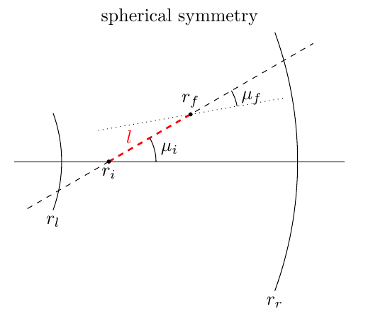

.. _propagation:

******************
Packet Propagation
******************

The bulk of a Monte Carlo Radiative Transfer calculation is spent on
determining the propagation history of the different packets. After a packet is
initialised, it is launched and may then perform interactions with the
surrounding material. This occurs again in a probabilistic manner. The packet
propagation is followed until it escapes through the outer boundary of the
computational domain, at which point the packet contributes to the synthetic
spectrum, the main product of a TARDIS calculation. The different spectral
features are simply a combined product of the changes in the packet properties
induced in the radiation-matter interactions.

Initialization
==============

During each TARDIS Monte Carlo simulation cycle, a large number :math:`N` of
Monte Carlo packets are initialised at the lower boundary of the computational domain
(i.e. the photosphere). Since the inner boundary is currently treated as a
black-body in TARDIS, :math:`N` packets with energies

.. math::
    \varepsilon = \frac{4 \pi R_{\mathrm{phot}}^2 \sigma_{\mathrm{R}} T_{\mathrm{phot}}^4 \Delta t}{N}

are initialised (the black body temperature :math:`T_{\mathrm{phot}}`, the
photospheric radius :math:`R_{\mathrm{phot}}`, the Stefan-Boltzmann constant
:math:`\sigma_{\mathrm{R}}` and the physical duration of the simulation
:math:`\Delta t` appear here). To commence the packet propagation, each packet
is assigned an initial propagation direction (note that propagation direction is defined as :math:`\mu = \cos
\theta` with :math:`\theta` being the angle the photon path makes with the
radial direction)

.. math::
    \mu = \sqrt{z}

and an initial frequency :math:`\nu` in random number experiments, using a
random number generator which provides uniformly distributed numbers :math:`z`
on the interval :math:`[0,1]`. The frequency assignment is more involved than
selecting an initial propagation direction, since the Planck function has to be
sampled. TARDIS uses the technique described in :cite:`Carter1975` and
summarized in :cite:`Bjorkman2001` for this purpose.

.. _expansion:

Model of Supernova Domain
=========================

TARDIS models supernovae as expanding homologously. This means that at the beginning of the explosion, the supernova starts at a single point and proceeds to expand radially outward such that the ratio of the velocity of the ejecta to the distance from the ejecta to the supernova's center is uniform throughout the supernova. As an example, if the outer edge of the ejecta moves outward at some velocity :math:`v_\mathrm{outer\_boundary}`, the velocity of the ejecta half way between the outer edge and the center would be :math:`\frac{v_\mathrm{outer\_boundary}}{2}`. The animation below demonstrates this type of expansion.

TARDIS simulates radiative transfer between an inner boundary (the photosphere, as discussed above) and an outer boundary (the outer edge of the supernova ejecta). The velocity of the inner boundary :math:`v_\mathrm{inner\_boundary}` and the velocity of the outer boundary :math:`v_\mathrm{outer\_boundary}` are supplied in the configuration file (see :ref:`config-file`), as well as the time after the explosion for which TARDIS is calculating the spectrum (:math:`t_\mathrm{explosion}`). The radii of the inner and outer boundaries are therefore calcuated by :math:`r_\mathrm{inner\_boundary}=v_\mathrm{inner\_boundary}*t_\mathrm{explosion}` and :math:`r_\mathrm{outer\_boundary}=v_\mathrm{outer\_boundary}*t_\mathrm{explosion}`. Plasma at a distance :math:`r` from the center of the supernova would then be traveling outward at a speed :math:`v=\frac{r}{r_\mathrm{outer\_boundary}}v_\mathrm{outer\_boundary} = \frac{r}{t_\mathrm{explosion}}`. This is also shown in the animation.

Additionally, TARDIS divides the space between the inner and outer computational boundaries into cells -- radial shells for which the plasma state is (spatially) constant. In the animation, 6 cells are shown, being divided by the light blue lines. As TARDIS is a time-independent code which calculates the spectra at an instant in time, the radii of the boundaries (either of the computational domain or of the cells) do not chage throughout the simulation.

Propagation in a Spherical Domain
=================================

Once the initial packet properties are assigned, the propagation process
commences. Without interacting, a packet, like a photon, will propagate on a
straight trajectory.

.. note::
    Since TARDIS is designed for systems for which the Newtonian limit may be
    safely applied, no general relatistic effects which would force photons on
    curved trajectories are included.

In spherical geometry, this propagation process may be illustrated by the
following sketch (taken from :cite:`Noebauer2014`):

The packet starts the propagation at :math:`r_i` along the direction
:math:`\mu_i`. After covering a distance :math:`l`, the packet is now located
at

.. math::
    r_f = \sqrt{r_i^2 + l^2 + 2 l r_i \mu_i}.

Note that the propagation direction has also changed and now takes the value

.. math::
    \mu_f = \frac{l + r_i \mu_i}{r_f}.
    
    
.. _referenceframes:

Reference Frames
================
In TARDIS, two reference frames are of particular importance: the lab frame and the co-moving frame. In the lab frame, the center of the supernova is at rest; for example, the animation above is shown in the lab frame. This is the frame for which the spectra are calculated.

The co-moving frame at some point in the supernova, however, has the plasma at that point be at rest. This is the frame of reference "according to the plasma."

If a photon is propagating in the ejecta with a frequency :math:`\nu_\mathrm{lab}` in the lab frame and a propagation direction :math:`\mu`, the doppler effect says that in the co-moving frame at a distance :math:`r` from the center of the supernova, the photon's frequency is shifted to

.. math::
    \nu_\mathrm{co-moving} = \nu_\mathrm{lab}\frac{1-\beta\mu}{\sqrt{1-\beta^2}}
    
where :math:`\beta = \frac{v}{c} = \frac{r}{ct_\mathrm{explosion}}` (note again that :math:`v` is the velocity of the plasma at a radius :math:`r` from the center of the supernova). The term :math:`\frac{1-\beta\mu}{\sqrt{1-\beta^2}}` is known as the doppler factor. In the nonrelativistic limit (as :math:`v << c`), we get

.. math::
    \nu_\mathrm{co-moving} = \nu_\mathrm{lab}(1-\beta\mu).
    
Note that if the photon is propagating away from the center of the supernova (:math:`\mu>0`) it is red-shifted (:math:`\nu_\mathrm{co-moving}<\nu_\mathrm{lab}`), and if the photon is propagating towards the center of the supernova (:math:`\mu<0`) it is blue-shifted (:math:`\nu_\mathrm{co-moving}>\nu_\mathrm{lab}`).

Numerical and Physical Events
=============================
While a packet is propagating through the computational domain, TARDIS calculates the distance the packet will propagate until it (i) crosses into a new cell and (ii) interacts with the plasma in the ejecta. If the former distance is shorter, the packet will be moved into the new cell (and the plasma properties will be recalculated), and if the latter distance is shorter, the packet will be moved to the location of the interaction, and the interaction will be performed.

Distance to Next Cell
---------------------

.. note::
    In this documentation, and in TARDIS as a whole, the subscripts "inner" and "outer" refer respectively to the inner an outer boundaries of a cell. The subscripts "inner_boundary" and "outer_boundary" refer respectively to the inner and outer boundaries of the computational domain.

As previously mentioned, the physical properties of the plasma are stored in a discrete mesh of cells for which the plasma state is spatially constant. As a consequence, whenever a packet propagates into a
new cell, important quantities which are relevant for performing
radiation-matter interactions have to be re-evaluated in accordance with the
new state of the ambient material. Thus, during the packet propagation, the
distance to the next radial shell is tracked to predict when the packet crosses
into a new shell. The following figures summarize the calculations
of these distances:

The calculations for the distance to the outer cell boundary:

.. image:: ../../graphics/d_outer.png
    :width: 500

The calculations for the distance to the inner cell boundary:

.. image:: ../../graphics/d_inner.png
    :width: 500
    
Special care is taken at the edges of the computational
domain. If a packet crosses back into the photosphere, it is discarded. Its
propagation is stopped and it is no longer considered. Instead, processing the
next packet of the population is started. Similarly, the propagation is stopped
if the packet escapes through the outer surface of the domain. However, in this
case the packet contributes to the final emergent spectrum (see :ref:`Spectrum
Formation <virtual_packets>`).

When a packet is moved into a new cell, as mentioned before, it is moved to the location at which it crosses the boundary, the plasma properties are recalculated, and the propagation direction of the packet is updated (using :math:`\mu_f = \frac{l + r_i \mu_i}{r_f}`).

Physical Interactions
---------------------

As a packet propagates through the computational domain, physical radiation-matter interactions can trigger changes in the packet properties. The probability that a photon/packet will interact with matter is characterized by its optical depth :math:`\tau`; the probability that a packet will have interacted after going through an optical depth :math:`\Delta \tau` is :math:`1-e^{-\Delta \tau}`. To model this (see :ref:`Random Sampling <randomsampling>`), the packet is assigned a random value of optical depth :math:`\tau_\mathrm{interaction} = -\log z` (for another random :math:`z` between 0 and 1), and upon reaching that optical depth, the packet will interact.

TARDIS considers two different radiation-matter interactions within the simulation: electron scattering and atomic line interactions. As packets propagate, they accumulate optical depth due to the possibility of going through either of these interations. Since the main focus of TARDIS is to calculate optical spectra,
electron-scatterings are treated in the elastic low-energy limit as classical
Thomson scatterings. In this case, the electron scattering process is frequency-independent. As a consequence to the frequency independence, the rate at which a packet accumulates electron scattering optical depth depends only on the free electron density :math:`n_e`. The optical depth that a Monte Carlo packet accumulates along a path of length :math:`l` due to
Thomson scattering is calculated by the formula

.. math::

    \Delta \tau = \sigma_{\mathrm{T}} n_e l.

The Thomson cross section :math:`\sigma_{\mathrm{T}}`, which is a constant,
appears here. This corresponds to the fact that a packet has a probability of :math:`1-e^{\sigma_{\mathrm{T}} n_e l}` of going through a Thomson scattering prior to traveling a distance :math:`l` (in other words, the probability of the packet making it across a distance :math:`l` without scattering is :math:`e^{\sigma_{\mathrm{T}} n_e l}`).

The situation is complicated by the inclusion of frequency-dependent
bound-bound interactions, i.e. interactions with atomic line transitions.
Photons and thus Monte Carlo packets can only interact with a line transition
if their frequency in the co-moving frame corresponds to the energy difference between the
atomic levels linked by the transition, i.e. if it comes into resonance. As discussed above, as a
photon/packet propagates through the homologously expanding ejecta, its
co-moving frame frequency is continuously red- or blue-shifted (depending on the packet's propagation direction). 
Thus, during its
propagation through the supernova ejecta, a photon/packet may come into resonance with
many line transitions. This and the fact that line transitions have a finite
width given by the line profile function (in the case at hand, this width is
mainly given by thermal broadening) would render the determination of the line
optical depth accumulated along the photon/packet trajectory a complicated
task. Fortunately, the typical conditions in supernova ejecta warrant the use
of the so-called Sobolev approximation. Roughly speaking, this approximation replaces the line
profile function with a :math:`\delta` distribution around the natural line
frequency. Thus, photons/packets may only interact with a line transition if
their co-moving frame frequency exactly equals the natural frequency of the
line. The location at which this occurs is referred to as the resonance or
Sobolev point. This effectively reduces the line optical depth determination to
a pure local problem.

If a packet with a frequency :math:`\nu_\mathrm{lab}` in the lab frame is at a radius :math:`r_i` with a propagation direction :math:`\mu_i`, the distance that the packet must travel to reach the next Sobolev point is calculated by setting the frequency of the packet in the co-moving frame at the Sobolev point equal to the resonant frequency that it will next hit, which we will label :math:`\nu_\mathrm{line}` (which is, of course, in the co-moving frame). Using the nonrelativistic doppler shift formula, we get

.. math:: \nu_\mathrm{line} = (1-\beta_f \mu_f)\nu_\mathrm{lab}

where the subscript :math:`f` refers to being at the sobolev point. Using :math:`\beta_f=\frac{r_f}{ct_\mathrm{explosion}}` and :math:`\mu_f = \frac{l + r_i \mu_i}{r_f}`, we get that the distance :math:`l` to the next Sobolev point is

.. math:: l = \left( 1-\beta_i\mu_i - \frac{\nu_\mathrm{line}}{\nu_\mathrm{lab}} \right)ct_\mathrm{explosion} = \frac{\nu_{\mathrm{CMF},i}-\nu_\mathrm{line}}{\nu_\mathrm{lab}}ct_\mathrm{explosion}

where :math:`\nu_{\mathrm{CMF},i}` is the frequency of the packet in the co-moving frame at the initial position.

At a Sobolev point, the packet instantaneously accumulates optical depth, the value of which is called the Sobolev optical depth :math:`\tau_\mathrm{Sobolev}` (see :ref:`tau_sobolev`). This corresponds to a probability of :math:`1-e^{-\tau_\mathrm{Sobolev}}` that the packet interacts with the atomic line.

Distance to Next Event
---------------------- 

With these assumptions, the accumulation of optical depth along a packet's trajectory currently proceeds according
to the following scheme (which was originally introduced by :cite:`Mazzali1993`): 
given the current lab-frame frequency of the packet, the distance to the next
Sobolev point (i.e. to the next line resonance) is calculated as discussed above. 
Until this location, the packet continuously accumulates optical depth due to the possibility of
electron-scattering. At the Sobolev point, the accumulated optical depth is
instantaneously incremented by the Sobolev optical depth. Afterwards, the
procedure is repeated, now with respect to the next transition in the
frequency-ordered list of all possible atomic line transitions. The point at
which the accumulated optical depth reaches the randomly generated interaction optical depth :math:`\tau_\mathrm{interaction}` determines the type of interaction the packet performs and at which location in the spatial mesh, as shown with the example cases in the sketch below (taken from :cite:`Noebauer2014`, adapted from
:cite:`Mazzali1993`):

.. image::
    images/optical_depth_summation.png
    :width: 500

Three possible cases are highlighted in the above diagram, with the dotted lines showing the (randomly assigned) optical depth :math:`\tau_\mathrm{interaction}` at which the packet interacts. In case I, the interaction optical
depth value is reached on one of the path segments between successive Sobolev
points, where the packet is accumulating electron scattering optical depth.
Thus, the packet performs a Thomson scattering at the point at which its accumulated optical depth reaches :math:`\tau_\mathrm{interaction}`. In case II, the interaction
optical depth is reached during the instantaneous increment by the line optical
depth at one of the Sobolev points. As a consequence, the packet performs an
interaction with the corresponding atomic line transition. In both of these cases, the packet is moved to the interaction location, the interaction will be performed (as will be described in the next section), and the process of accumulating optical depth starts over. Finally, if the packet reaches the shell boundary before the optical depth value necessary for a physical interaction is achieved (as in case III), the packet will be moved to the next cell, the plasma properties will be updated, and the accumulation of optical depth will continue in the next cell.

Performing an Interaction
-------------------------

When a physical interaction occurs, whether it is a Thomson scattering or a line interaction, the packet is moved to the interaction location and a new propagation direction is assigned. Since this process is isotropic, the new direction is
sampled according to

.. math::

    \mu_f = 2 z - 1.
    
using a new random :math:`z` (between 0 and 1).

For Thomson scattering, the energy of the packet in the co-moving frame is conserved, and thus the new energy and frequency of the packet in the lab frame (due to the doppler effect) is:

.. math::

    \varepsilon_f & = \varepsilon_i \frac{1 - \beta \mu_i}{1 - \beta \mu_f} \\
    \nu_f & = \nu_i \frac{1 - \beta \mu_i}{1 - \beta \mu_f}
    
Here, the subscripts highlight the packet properties before (:math:`i` for
initial) and after (:math:`f` for final) the scattering. Note that :math:`\mu_i` is the propagation direction prior to the interaction **but at the interaction location.**

For line interactions, the energy of the packet after the interaction is still given by the same formula (based on energy conservation in the co-moving frame). However, the post-interaction frequency depends on the selected line interaction treatment (see :ref:`Line Interaction Treatments <lineinteraction>`).

The ratio :math:`\frac{1 - \beta \mu_i}{1 - \beta \mu_f}` can be visualized with the following graph for a plasma speed of :math:`1.1 \times 10^4` km/s:

.. plot:: physics/pyplot/plot_mu_in_out_packet.py

Implementation: Main Propagation Loop
=====================================

In summary of the concepts outlined above, the main Monte Carlo process within
TARDIS consists of successively processing all packets with represent the
radiation field emitted by the photosphere in the following way:

* initialize the packet: assign initial energy, direction and frequency
* launch the packet: now the propagation of this packet is followed until one of the termination events is triggered
* follow the propagation:
    * calculate the distance to the next shell and determine the distance to the next physical interaction
    * the packet covers the shorter of these two distances:
       * if the new shell is reached first, propagate into the shell and recalculate both distances
       * if the packet has crossed through the inner domain boundary (photosphere), terminate propagation
       * likewise, in case the packet escapes through the outer boundary (ejecta surface): account for contribution to emergent spectrum and terminate propagation
       * if the interaction location is reached first, propagate to this location, perform interaction and recalculate both distances
    * repeat this procedure until one of the two termination events occurs

The following flow chart summarizes this process again:

.. graphviz::

  digraph {
    start[shape="box", style=rounded, label="Start"];
    end[shape="box", style=rounded, label="End"];
    allpacketsprocessed[shape="diamond", style="", label="All packets\nprocessed?"];
    shortestdistance[shape="diamond", style="", label="Distance to next\nshell shortests?"];
    outeredge[shape="diamond", style="", label="Escaping through\nsurface?"];
    inneredge[shape="diamond", style="", label="Crossing into\nphotosphere?"];

    nextpacket[shape="box", style="rounded", label="Select next\npacket"];
    initpacket[shape="box", style="rounded", label="Initialize packet"];
    calculatedistances[shape="box", style="rounded", label="Calculated distances:\nto next cell, to next interaction"];
    crossintoshell[shape="box", style="rounded", label="Move packet into\nnext cell"];
    terminate[shape="box", style="rounded", label="Terminate propagation,\ndiscard packet"];
    interact[shape="box", style="rounded", label="Move packet to interaction location,\nperform interaction"];
    spectralcontrib[shape="box", style="rounded", label="Determine contribution to spectrum"];

    start -> allpacketsprocessed;
    allpacketsprocessed -> nextpacket[label="no"];
    allpacketsprocessed -> end[label="yes"];

    nextpacket -> initpacket;
    initpacket -> calculatedistances;
    calculatedistances -> shortestdistance;
    shortestdistance -> outeredge[label="yes"];
    shortestdistance -> interact[label="no"];
    interact -> calculatedistances;
    crossintoshell -> calculatedistances;
    outeredge -> spectralcontrib[label="yes"]
    outeredge -> inneredge[label="no"]
    inneredge -> terminate[label="yes"]
    inneredge -> crossintoshell[label="no"];
    spectralcontrib -> terminate;
    terminate -> allpacketsprocessed;

    allpacketsprocessed[label="All packets\nprocessed?"]
    nextpacket[label="Select next packet\nfrom pool"]
    shortestdistance[label="Distance to cell\nedge shortest?"]
    
  }
