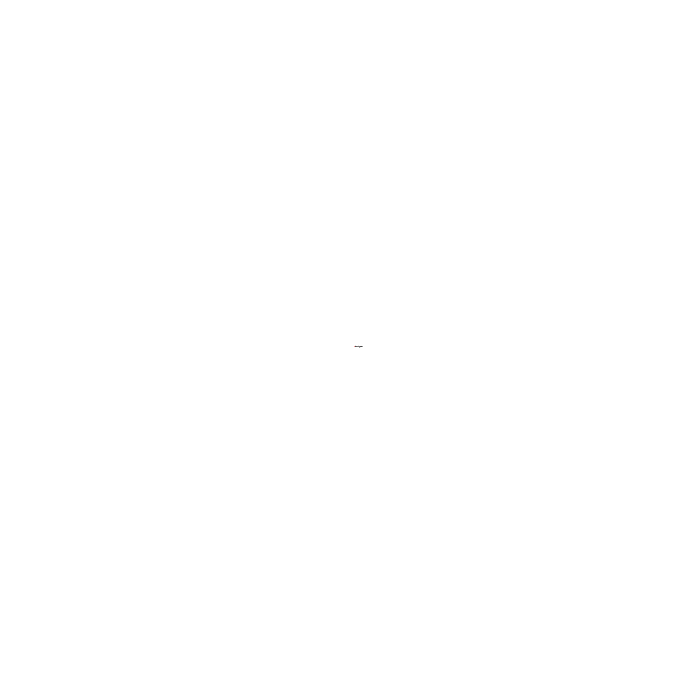

.. _model:

*************************
Model of Supernova Domain
*************************

TARDIS models supernovae as expanding homologously. This means that at the beginning of the explosion, the
supernova starts at a single point and proceeds to expand radially outward such that the ratio of the velocity of
the ejecta to the distance from the ejecta to the supernova's center is uniform throughout the supernova. As an
example, if the outer edge of the ejecta moves outward at some velocity :math:`v_\mathrm{outer\_boundary}`, the
velocity of the ejecta half way between the outer edge and the center would be
:math:`\frac{v_\mathrm{outer\_boundary}}{2}`. The animation below demonstrates this type of expansion.

TARDIS simulates radiative transfer between an inner boundary (the photosphere) and an outer
boundary (the outer edge of the supernova ejecta). The velocity of the inner boundary
:math:`v_\mathrm{inner\_boundary}` and the velocity of the outer boundary :math:`v_\mathrm{outer\_boundary}` are
supplied in the configuration file (see :ref:`model-csvy-and-config`), as well as the time after the explosion for
which TARDIS is calculating the spectrum (:math:`t_\mathrm{explosion}`). The radii of the inner and outer boundaries
are therefore calcuated by :math:`r_\mathrm{inner\_boundary}=v_\mathrm{inner\_boundary}*t_\mathrm{explosion}` and
:math:`r_\mathrm{outer\_boundary}=v_\mathrm{outer\_boundary}*t_\mathrm{explosion}`. Plasma at a distance :math:`r`
from the center of the supernova would then be traveling outward at a speed
:math:`v=\frac{r}{r_\mathrm{outer\_boundary}}v_\mathrm{outer\_boundary} = \frac{r}{t_\mathrm{explosion}}`. This is
also shown in the animation.

Additionally, TARDIS divides the space between the inner and outer computational boundaries into cells -- radial
shells for which the plasma state is (spatially) constant. In the animation, 6 cells are shown, being divided by the
light blue lines. As TARDIS is a time-independent code which calculates the spectra at an instant in time, the radii
of the boundaries (either of the computational domain or of the cells) do not chage throughout the simulation.

