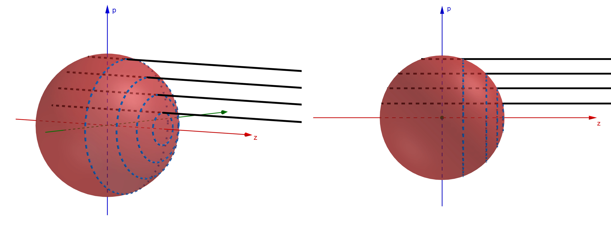
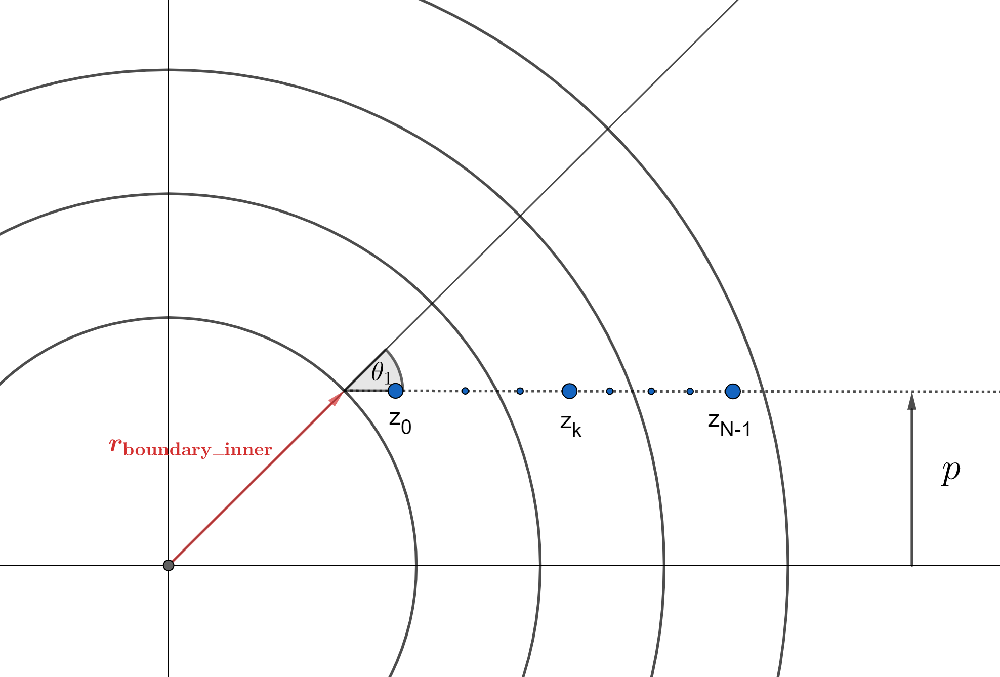

.. _formal_integral:

********************************************
Spectrum Generation with the Formal Integral
********************************************

:cite:`Lucy1999a` describes an alternative method for calculating the TARDIS spectrum while eliminating nearly all Monte Carlo noise. Instead of calculating the spectrum directly from the Monte Carlo (or virtual) packets, we use information from the Monte Carlo simulation to build an analytical solution for the supernova spectrum.

.. warning::

  The current implementation of the formal integral has several limitations.
  Please consult the corresponding section below to ensure that these
  limitations do not apply to your TARDIS.

Deriving the Integral
=====================

The spectrum generated by TARDIS includes light that is released in all directions. However, we approximate the supernova as spherically symmetric, meaning the light is released isotropically (equally in all directions). Thus, it will suffice to calculate the spectrum of light propagating in a single direction, call it the positive z-direction, and then sum over every direction. Specifically, we have

.. math:: L_\nu = \int L_{\nu z} d\Omega = L_{\nu z} \int d\Omega = 4\pi L_{\nu z}

where :math:`L_\nu` is the luminosity density at a frequency :math:`\nu`, :math:`L_{\nu z}` is the luminosity density at a frequency :math:`\nu` for light propagating in the positive z-direction, and :math:`\Omega` is the solid angle.

We now must calculate :math:`L_{\nu z}`, starting with more symmetry considerations. The figures below show various rays of light (in black) coming out of the supernova at various values of :math:`p`, the impact parameter (defined as the distance from the x-axis, and can be seen as the value along the blue :math:`p`-axis). By symmetry, the intensity :math:`I_\nu` (luminosity density per unit area) along the ray will be identical anywhere on the blue circles shown (each of which has a constant impact parameter). Each circle has a circumference of :math:`2\pi p`. The luminosity density per unit distance on any given circle would then be :math:`I_\nu(p)\times 2\pi p` (specifically, we are integrating the constant intensity around the circumference of the circle). Finally, to get :math:`L_{\nu z}`, we must integrate :math:`I_\nu(p)\times 2\pi p` over every possible impact parameter, whose values range from zero to the outer radius of the supernova, :math:`r_\mathrm{boundary\_outer}`. So,

.. math:: L_{\nu z} = \int_0^{r_\mathrm{boundary\_outer}} I_\nu(p)\times 2\pi p dp = 2\pi \int_0^{r_\mathrm{boundary\_outer}} I_\nu(p) p dp.

Putting this all together, we get

.. math:: L_\nu = 8\pi^2 \int_0^{r_\mathrm{boundary\_outer}} I_\nu(p) p dp.

.. note::

  A separate integral must be done for each frequency.

Summary of Implementation
=========================

Since there is a continuum of frequencies represented in a spectrum, the formal integral cannot calculate the luminosity density at *every* frequency. Instead, we calculate :math:`L_\nu` at a finite number of frequencies between the ``start`` and ``stop`` wavelengths provided in the :ref:`spectrum-config` (converting between frequency and wavelength using :math:`\nu=\frac{c}{\lambda}` where :math:`\lambda` is wavelength and :math:`c` is the speed of light) to give us an approximate spectrum. The number of frequencies we use is the ``num`` argument in the configuration. The frequencies are evenly spaced **in wavelength space** (exactly like histogram bins in :doc:`basic` -- see near the bottom of that page for more information).

Similarly, when doing the integral for a particular frequency, there is a continuum of impact parameters, so we cannot calculate :math:`I_\nu(p)` for every single one. We instead use a finite list of impact parameters between 0 and the supernova's outer boundary. The number of impact parameters we use is the value of ``points`` provided in the ``integrated`` section of the spectrum configuration.

For each frequency in our list of frequencies, TARDIS calculates :math:`I_\nu(p)` for each :math:`p` in the list of impact parameters, and then performs the integral :math:`\int_0^{r_\mathrm{boundary\_outer}} I_\nu(p) p dp` using `trapezoid integration <https://en.wikipedia.org/wiki/Trapezoidal_rule>`_. Our result is then multiplied by :math:`8\pi^2` to get the correct luminosity density. The most involved part of the calculation is calculating :math:`I_\nu(p)` for every combination of :math:`\nu` in the list of frequencies and :math:`p` in the list of impact parameters. This step is described in detail in the following section:

Calculating :math:`I_\nu(p)`
============================

Setting Up
----------

We now calculate :math:`I_\nu(p)`, which is the intensity of the light with a **lab frame** (see :ref:`referenceframes`) frequency :math:`\nu` exiting a the supernova along a ray with impact parameter :math:`p`, as shown in the diagram below (we use the lab frame frequency as that is the frame in which the spectrum is observed). Specifically, we are looking for the intensity of light with a frequency :math:`\nu` traveling to the right on the right side of the ray. We start by discussing the case where :math:`p>r_\mathrm{boundary\_inner}` (where the ray does not intersect the photosphere). After, we will comment on what occurs when :math:`p<r_\mathrm{boundary\_inner}`.

.. image:: ../images/formal_integral_2d_above.png

Since every point on the ray has the same lab frame frequency, the co-moving frequency will vary along the ray. Specifically, at the point :math:`z_k`, we have

.. math:: \nu_{\mathrm{co-moving},k}=(1-\beta_k \mu_k)\nu = \left( 1-\frac{r_k \cos(\theta)}{ct_\mathrm{explosion}}\right) \nu.

But, :math:`\cos(\theta)=\frac{z_k}{r_k}`, so

.. math:: \nu_{\mathrm{co-moving},k}= \left( 1-\frac{z_k}{ct_\mathrm{explosion}}\right) \nu.

Notice that the co-moving frequency decreases as you move farther to the right, i.e. as the z-coordinate increases. With this, we can see where along the ray each line resonance occurs -- a line with a frequency :math:`\nu_\mathrm{line}` (which comes into resonance in the co-moving frame) will come into resonance at :math:`z=ct_\mathrm{explosion}\left(1-\frac{\nu_\mathrm{line}}{\nu}\right)`. The highest line frequency that can resonate on our ray is :math:`\nu_\mathrm{max}=\left(1-\frac{z_\mathrm{min}}{ct_\mathrm{explosion}}\right)\nu`, and the lowest line frequency that can resonate on our ray is :math:`\nu_\mathrm{min}=\left(1-\frac{z_\mathrm{max}}{ct_\mathrm{explosion}}\right)\nu`, where :math:`z_\mathrm{max}=\sqrt{r_\mathrm{boundary\_outer}^2-p^2}` and by symmetry :math:`z_\mathrm{min}=-z_\mathrm{max}`. Every line between those frequencies will resonate on our ray -- the points at which each line resonates is shown on the diagram (though in reality there are far more resonances than in this shown in this example diagram). The line resonating at the point :math:`z_0` has the highest frequency of any line with a frequency below :math:`\nu_\mathrm{max}`, and the line resonating at the point :math:`z_{N-1}` (the Nth line) has the highest frequency of any line with a frequency above :math:`\nu_\mathrm{min}`. Finally, we denote the intensity along the ray directly to the left of a point :math:`z_k` as :math:`I_k^b` with "b" for blue, as it has a slightly higher ("bluer") frequency than the line resonating at :math:`z_k`. Similarly, we denote the intensity along the ray directly to the right of a point :math:`z_k` as :math:`I_k^r` with "r" for red, as it has a slightly lower ("redder") frequency than the line resonating at :math:`z_k`.

Our goal is to find :math:`I_{N-1}^r`, as this is the light that will exit the supernova. We start with :math:`I_0^b=0` (as we assume no light is entering the supernova externally). We then increment the intensity along the ray. To do this, we will need the line source function.

Constructing the Source Function
--------------------------------

Our problem is to determine the intensity that is added to the ray at a line resonance :math:`l\rightarrow u` based on the Monte Carlo packets.

Consider another transition :math:`i\rightarrow u`. We know (see :ref:`edotlu`) that the rate at which energy density interacts with the transition is :math:`\dot{E}_{iu}`, i.e. the ``Edotlu`` estimator for the transition :math:`i\rightarrow u`. Now, sum up these estimators for every level :math:`i` that can be excited to the level :math:`u` -- this will give us the rate at which energy density is added to the level :math:`u` from all line transitions that can be excited to :math:`u`:

.. math:: \dot{E}_u = \sum_{i < u} \dot E_{iu}.

The rate at which energy density is then de-excited from :math:`u\rightarrow l` (and thus be deposited into the ray's intensity at the resonance point of :math:`l\rightarrow u`) is :math:`q_{ul}\dot{E}_u`, where :math:`q_{ul}` is the fraction of energy at the level :math:`u` which de-excites in the transition :math:`u\rightarrow l`. To turn this into the intensity added to the ray at a resonance point, for reasons presented in :cite:`Lucy1999a`, we include a factor of :math:`\frac{\lambda_{ul} t_\mathrm{explosion}}{4 \pi}` where :math:`\lambda_{ul}` is the wavelength of the light released in the transition :math:`u\rightarrow l`. So, the intensity that is added to our ray at the resonance point of :math:`l\rightarrow u`, which we will label as :math:`\left( 1- e^{-\tau_{lu}}\right) S_{ul}`, is

.. math:: \left( 1- e^{-\tau_{lu}}\right) S_{ul} = \frac{\lambda_{ul} t}{4 \pi} q_{ul}\dot E_u.

Here, :math:`S_{ul}` is the source function -- interpret it as the intensity that is eligible to interact and end up on our ray (i.e. the source of the intensity that ends up on our ray). The actual intensity that ends up being added to the ray is the source function times the probability of the transition :math:`l\rightarrow u`, which is :math:`\left( 1- e^{-\tau_{lu}}\right)`.

Incrementing the Intensity
--------------------------

With this, we can now show how the intensity along our ray is incremented. First, at the kth line resonance there is an :math:`e^{-\tau_{k}}` probability that light does not interact with the line. So, on the red side of the line we only have :math:`e^{-\tau_k}` times the intensity on the blue side. But, we also have an intensity :math:`\left(1- e^{-\tau_k}\right) S_k` that is added to the ray at the line resonance, so in total we have

.. math:: I_k^r = I_k^b e^{-\tau_k} + \left( 1- e^{-\tau_k}\right) S_{k}.

If there is no electron scattering, this would be it; we would have :math:`I^b_{k+1}=I^r_k` (the intensity on the left of a line would be the intensity on the right of the next line, since no interactions would take place between the locations of line resonances). However, with electron scattering, this is not the case. In between line resonances, light has a probability of :math:`e^{-\Delta \tau_e}` of not scattering, where :math:`\Delta \tau_e=\sigma_{\mathrm{T}} n_e \Delta z` is the electron scattering optical depth (see :ref:`physical-interactions`). So, we would have :math:`I^b_{k+1}=I^r_ke^{-\Delta \tau_e}`. But, light can also scatter onto the ray. The intensity is increased by the mean intensity between the two resonance points times the probability of light scattering (and thus ending up on the ray), this probability being :math:`1-e^{-\Delta \tau_e}`. For the intensity between :math:`z_k` and :math:`z_{k+1}` we use the average of the mean intensity to the right of :math:`z_k` and the mean intensity to the left of :math:`z_{k+1}`, which is :math:`\frac{1}{2}\left(J_k^r+J_{k+1}^b\right)`. Here, :math:`J^b_{k}` is calculated from the ``j_blue`` estimator for the kth line transition (see :ref:`j-blue-estimator`), and then

.. math:: J_k^r = J_k^b e^{-\tau_k} + \left( 1- e^{-\tau_k}\right) S_{k}

for the same reasoning as before (since :math:`J`, like :math:`I`, is an intensity and thus by identical logic is increased by :math:`\left( 1- e^{-\tau_k}\right) S_{k}` at line resonances).

This gives us

.. math:: I_{k+1}^b = I_k^r e^{-\Delta \tau_e} + (1-e^{-\Delta \tau_e})*\frac{1}{2}\left(J_k^r+J_{k+1}^b\right).

Note that here the mean intensity is acting as the source function. The final step, for computational ease, approximates :math:`e^{-\Delta \tau_e}\approx 1-\Delta \tau_e` since the resonance points will be so close together that :math:`\Delta \tau_e << 1`. Our final result is then

.. math:: I_{k+1}^b = I_k^r + \Delta \tau_e \left[ \frac{1}{2}\left(J_k^r + J_{k+1}^b\right) - I_k^r  \right].

**In summary**, when calculating :math:`I_\nu(p)` for some ray, we start with :math:`I_0^b=0` and then calculate :math:`I_0^r`, then :math:`I_1^b`, then :math:`I_1^r`, etc. via the relations

.. math:: I_k^r = I_k^b e^{-\tau_k} + \left( 1- e^{-\tau_k}\right) S_{k}

.. math:: I_{k+1}^b = I_k^r + \Delta \tau_e \left[ \frac{1}{2}\left(J_k^r + J_{k+1}^b\right) - I_k^r  \right]

until we get to :math:`I_{N-1}^r`, which is then used as the value of :math:`I_\nu(p)` that goes into the integral :math:`L_\nu = 8\pi^2 \int_0^{r_\mathrm{boundary\_outer}} I_\nu(p) p dp`.

.. note:: The values for the source function (and the quantities and estimators used to calculate it), Sobolev optical depths, electron densities, the mean intensity, and all other non-constant quantities are taken in the cell in which the line resonance takes place. However, to improve results, TARDIS breaks down the model into more cells than used in the rest of the simulation and interpolates the values of these quantities. The number of shells TARDIS uses for this interpolation process is specified in the :doc:`spectrum configuration <../../io/configuration/components/spectrum>`.

Rays Intersecting the Photosphere
---------------------------------

Since the photosphere is modeled as being optically thick, if a ray intersects the photosphere, anything that happens prior to the photosphere does not matter -- the photosphere absorbs all light that hits it. Because of this, to calculate :math:`I_\nu(p)` over a ray that starts by exiting the photosphere, we must slightly adjust our approach, as shown in the diagram below. In this case, we now have that the minimum z-coordinate is :math:`z_\mathrm{min}=\sqrt{r_\mathrm{boundary\_inner}^2-p^2}`, and we use this to determine the lowest possible resonant frequency on the ray as before, which will then give us :math:`z_0`, as it did before. Finally, since light along this ray is released from the photosphere, we have

.. math:: I_0^b = B_\nu(T_\mathrm{inner})= \frac{2h}{c^2}\frac{\nu^3}{e^{h\nu/k_BT}-1}.

which is the Planck function (see :doc:`../montecarlo/initialization`). After making those small adjustments, we increment the intensity exactly as in the other case.

Current Limitations
===================

The current implementation of the formal integral has some limitations:

* Once electron scattering is included, the scheme only produces accurate results when many resonances occur on the rays. This is simply because otherwise the average of :math:`J^b` and :math:`J^r` does not provide an accurate representation of the mean intensity between successive resonance points. Also, :math:`d\tau` can become large which can create unphysical, negative intensities.

It is always advised to check the results of the formal integration against the
spectrum constructed from the emerging Monte Carlo packets.
