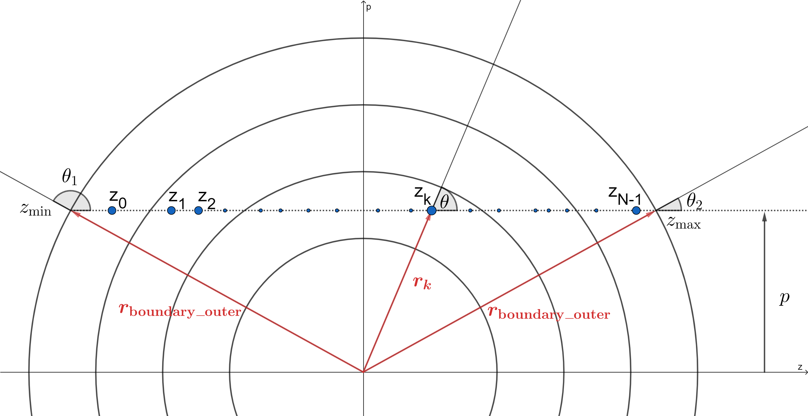

.. _formal_integral:

********************************************
Spectrum Generation with the Formal Integral
********************************************

:cite:`Lucy1999a` describes an alternative method for calculating the TARDIS spectrum while eliminating nearly all Monte Carlo noise. Instead of calculating the spectrum directly from the Monte Carlo (or virtual) packets, we use information from the Monte Carlo simulation to build an analytical solution for the supernova spectrum.

.. warning::

  The current implementation of the formal integral has several limitations.
  Please consult the corresponding section below to ensure that these
  limitations do not apply to your application.

Deriving the Integral
=====================

The spectrum generated by TARDIS includes light that is released in all directions. However, we approximate the supernova as spherically symmetric, meaning the light released in all directions is the same. Thus, it will suffice to calculate the spectrum of light propagating in a single direction, call it the positive z-direction, and then sum over every direction. Specifically, we have

.. math:: L_\nu = \int L_{\nu z} d\Omega = L_{\nu z} \int d\Omega = 4\pi L_{\nu z}

where :math:`L_\nu` is the luminosity density at a frequency :math:`\nu`, :math:`L_{\nu z}` is the luminosity density at a frequency :math:`\nu` for light propagating in the positive z-direction, and :math:`\Omega` is the solid angle.

The figures below show various rays of light (in black) coming out of the supernova at various values of :math:`p`, the impact parameter (defined as the distance from the x-axis, and can be seen as the value along the blue :math:`p`-axis). By symmetry, the intensity :math:`I_\nu` (luminosity density per unit area) along the ray will be identical anywhere on the blue circles shown (each of which has a constant impact parameter). Each circle has a circumference of :math:`2\pi p`. The luminosity density per unit distance on any given circle would then be :math:`I_\nu(p)*2\pi p` (specifically, we are integrating the luminosity around the circumference of the circle). Finally, to get :math:`L_{\nu z}`, we must integrate :math:`I_\nu(p)*2\pi p` over every possible impact parameter, which range from zero to the outer radius of the supernova, :math:`r_\mathrm{boundary\_outer}`. So,

.. math:: L_{\nu z} = \int_0^{r_\mathrm{boundary\_outer}} I_\nu(p)*2\pi p dp = 2\pi \int_0^{r_\mathrm{boundary\_outer}} I_\nu(p) p dp

and putting this all together,

.. math:: L_\nu = 8\pi^2 \int_0^{r_\mathrm{boundary\_outer}} I_\nu(p) p dp.

.. note::

  A separate integral must be done for each frequency.

Summary of Implimentation
=========================

Since there is a continuum of frequencies represented in a spectrum, the formal integral cannot calculate the luminosity density at every frequency. Instead, we calculate :math:`L_\nu` at a finite number of frequencies between the ``start`` and ``stop`` wavelengths provided in the :ref:`spectrum-config` (converting between frequency and wavelength using :math:`\nu=\frac{c}{\lambda}` where :math:`\lambda` is wavelength and :math:`c` is the speed of light) to give us an approximate spectrum. The number of frequencies we use is the ``num`` argument in the configuration. The frequencies are evenly spaced **in wavelength space** (exactly like histogram bins in :doc:`basic` -- see near the bottom of that page for more information).

Similarly, when doing the integral for a particular frequency, there is a continuum of impact parameters, so we cannot calculate :math:`I_\nu(p)` for every single one. We instead use a finite list of impact parameters between 0 and the supernova's outer boundary. The number of impact parameters we use is the value of ``points`` provided in the ``integrated`` section of the spectrum configuration.

For each frequency in our list of frequencies, TARDIS calculates :math:`I_\nu(p)` for each :math:`p` in the list of impact parameters, and then performs the integral :math:`\int_0^{r_\mathrm{boundary\_outer}} I_\nu(p) p dp` using `trapezoid integration <https://en.wikipedia.org/wiki/Trapezoidal_rule>`_. Our result is then multiplied by :math:`8\pi^2` to get the correct luminosity density. The most involved part of the calculation is calculating :math:`I_\nu(p)` for every combination of :math:`\nu` in the list of frequencies and :math:`p` in the list of impact parameters. This step is described in detail in the following section:

Calculating :math:`I_\nu(p)`
============================

Current Limitations
===================

The current implementation of the formal integral has some limitations:

* once electron scattering is included, the scheme only produces accurate
  results when multiple resonances occur on the rays. This is simply because
  otherwise the :math:`J^b` and :math:`J^r` do not provide an accurate
  representation of the diffuse radiation field at the current location on the
  ray. Also, :math:`d\tau` can become large which can create unphysical,
  negative intensities.

It is always advised to check the results of the formal integration against the
spectrum constructed from the emerging Monte Carlo packets.
