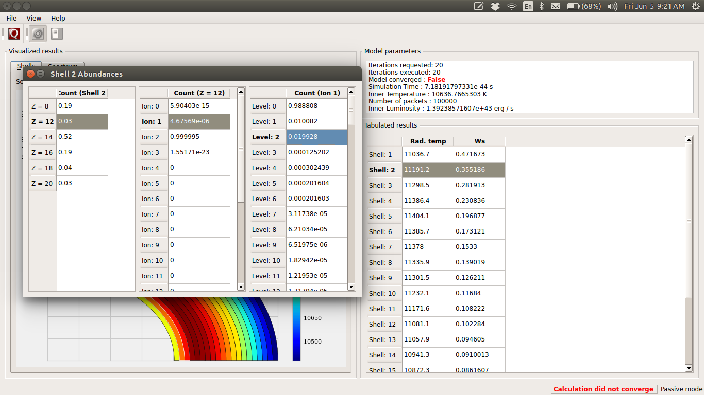
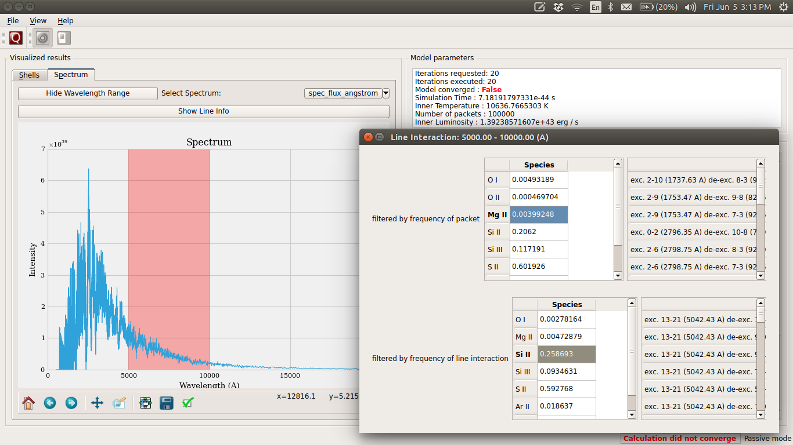

.. _gui:

************************
Graphical User Interface
************************

TARDIS uses the `PyQt4 framework <http://www.riverbankcomputing.com/software/pyqt/download>`_ for its cross-platform
interface.

Creating an instance of the :class:`ModelViewer`-class requires that PyQt4/PySide has already been initialized in
IPython. The above command to start IPython accomplishes this.

gui.py contains all the classes used to create the GUI for Tardis.

This module must be imported inside IPython console started above. The console provides the event loop and the place
to create/calculate the tardis model. So the module is basically a tool to visualize results.

**To setup and run the GUI (under development) follow these steps:**

The gui can use one of two python bindings for qt, namely PyQt4
and PySide. You can choose which binding is used by setting the
environment variable QT_API in your bash. Currently, the TARDIS team uses PyQT4

**1**. Installing required packages

.. code-block:: shell

	conda activate tardis
	conda install pyqt=4.8.7

**2**. Choosing between PySide and PyQt4

.. code-block:: shell

	#To choose PySide
	export QT_API=pyside

	#To choose PyQt - this is what the TARDIS team does
	export QT_API=pyqt

**3**. An example of creating a model and GUI

To show the gui from the ipython shell use the following commands.

.. code-block:: shell

	jupyter notebook

.. code-block:: python

	from tardis import run_tardis
	from tardis.gui import interface
	sim = run_tardis('yamlconfigfile.yml', 'atomdatafile.h5')

	interface.show(sim)

If you just want to run from a configuration file and show the results, you can
do that outside the jupyter notebook. Navigate to the folder where you
installed tardis and go to tardis/tardis/gui, and use the following command.

.. code-block:: none

    python interface.py path-to-yaml-configuration-file path-to-atomic-data-file

Running Instructions
--------------------
Decide which Qt binding you want to use (PySide or PyQt) and 
accordingly set QT_API in shell::

    export QT_API=pyside
    or:
    export QT_API=pyqt
        
Start the IPython console with eventloop integration::

    ipython --pylab=qt4
        
Display your model::
    
    from tardis import run_tardis
    mdl = run_tardis('yamlconfigfile.yml', 'atomdatafile.h5')
    from tardis.gui import interface  
    interface.show(mdl)

(WIP) You can also run a configuration from the shell. To do this first set 
QT_API in the shell. Then navigate to the tardis installation folder and go to
tardis/tardis/gui. Then use the command::
    
    python interface.py path-to-configuration-file path-to-atomic-data-file 

GUI Layout and Features
-----------------------
When you launch the gui the first screen that you see will be something like the snapshot below. 
You can inspect the plot of shells on this window and use the toggle button to change between the 
plot of dilution factor and the radiation temperature in shells.
    
.. image:: images/OpeningScreen.png
    :width: 900

Shell Info
~~~~~~~~~~
To see the abundances in a shell double-click on the shell number in the table. You can follow a 
similar strategy in the tables that appear to bring up the ion and level populations for each shell.
The snapshot below shows all the tables that you can bring up by successively clicking the horizontal
table headers. 

Line Info
~~~~~~~~~
If you switch to the spectrum tab you can see the spectrum plot and a button to show line info.
Once again you can double-click the table headers to get further information. The snapshot below
shows all the tables that you can bring up in this window.

