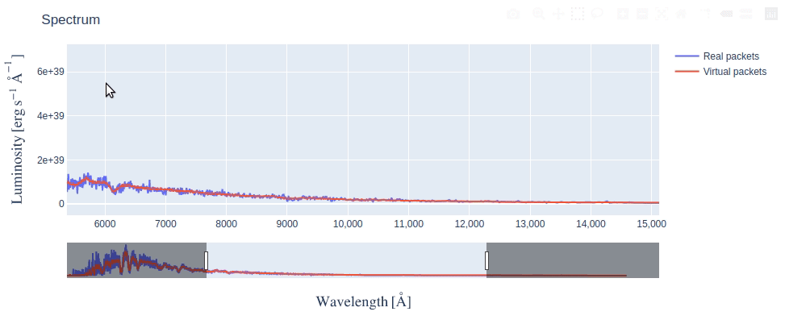

********************
Using TARDIS Widgets
********************

This page describes what each TARDIS Widget has to offer and how you can make
the best use of it. If you're looking for the code to generate widgets, head
over to `Generating TARDIS Widgets <generating_widgets>`_ section and see the
notebook in action.

Currently, TARDIS supports the following widgets:

Shell Info Widget
#################

This widget allows you to explore the chemical abundances in different shells
of the model Supernova ejecta.

.. image:: ../images/shell_info_widget_demo.gif
    :alt: Demo of Shell Info Widget

It consists of four interlinked tables - clicking on any row in a table,
populates data in the table(s) to the right of it. Each table has the
following information:

1. **Shells Data** - Radiative temperature and Dilution Factor (W) of each shell
(computational partitions) of the model Supernova ejecta. Shell numbers are
given in ascending order, from the innermost shell to the outermost.

2. **Element Abundances** - Fractional mass abundance of each element present
in the selected shell.

3. **Ion Abundances** - Fractional mass abundance of each ion (species) of the
selected element present in the selected shell. 

4. **Level Abundances** - Fractional mass abundance of each level of the
selected ion and element in the selected shell.

Line Info Widget
################

This widget lets you explore the atomic lines responsible for producing
features in the simulated spectrum.

.. image:: ../images/line_info_widget_demo.gif
    :alt: Demo of Line Info Widget

By selecting a wavelength range on the spectrum plot, you can see the species
that produced the features within that range. This is determined by counting
the number of escaping packets that experienced their last interaction with
each species. Packets can be filtered by the wavelength at which they were
absorbed or emitted, using the toggle buttons.

You can then click on a species to see the packets count for each last line
interaction it experienced. Using the dropdown menu, these counts can be grouped
by excitation lines, de-excitation lines, or both.

Interacting with Spectrum
=========================

The spectrum in the Line Info Widget is an interactive figure made using
`plotly <https://plotly.com/python/>`_, there are several things you can
do with it:

Making Selection
----------------
The box selection is enabled by default, so you just need to click and drag on
the figure and a pink colored selection box will appear. By making a
selection across the wavelength range you're interested in, tables update
to show line information of only packets from that range.

After making a selection, if you need to resize the selection box (say, make it
narrower), simply redraw a new selection box over the older one.

Using Rangesilder
-----------------
The rangeslider is a long bar below the figure that allows you to zoom in on a
particular wavelength range in the long spectrum.

.. image:: ../images/line_info_spectrum_rangeslider.gif
    :alt: Demo of using rangeslider

Either you can **slide** the zoomed range by clicking and dragging it or you 
can **resize** it by dragging the handles (vertical bars) at its edges.

Using other options in Modebar
------------------------------
If you take your mouse to the top right corner of the figure, you will see a
Modebar with multiple options. The default option when Line Info Widget first
displays is **Box Select** - the dotted square icon. You can click on other
options like **Zoom** (magnifying glass icon), to do a rectangular zoom which
may be helpful to focus on a feature in the spectrum. You can always revert
back to the initial state of the figure by clicking on **Reset Axes** option.

.. image:: ../images/line_info_spectrum_modebar.gif
    :alt: Demo of using modebar options

There are also several other options in the modebar which we have not explained
(because they are not very relevant) but you're free to explore them as long as
you remember to click back on the **Box Select** option for making selections on
spectrum.

.. Toggle legend
